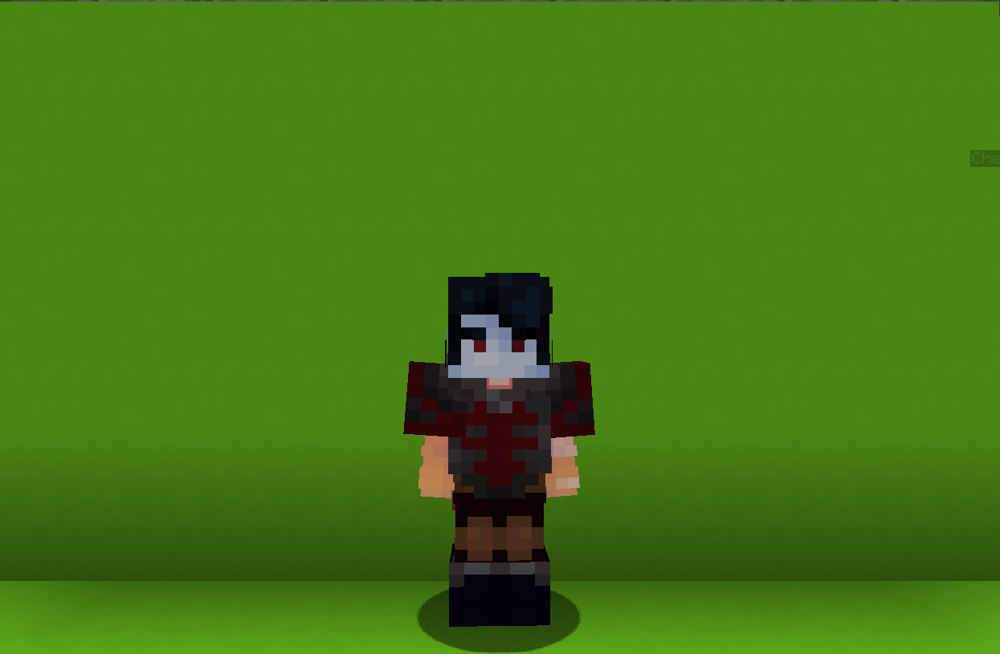

<table>
    <tr>
        <th>Bloodfiend</th>
    </tr>
</table>

<table>
    <tr>
        <th>Description</th>
    </tr>
</table>

>A vampire prince with sunscreen.
  Archetype:<b> 💢 Archetype</b>

 
<table>
    <tr>
        <th>Attributes</th>
    </tr>
</table>
<table>
  <tr>
    <th>Health</th>
    <td>♥ 80</td>
  </tr>
    <th>Attack</th>
    <td>🗡 100</td>
  <tr>
    <th>Defence</th>
    <td>🛡 100</td>
  </tr>
  <tr>
    <th>Speed</th>
    <td>🌊 100%</td>
  </tr>
  <tr>
    <th>Crit Chance</th>
    <td>☢ 10%</td>
  </tr>
  <tr>
    <th>Crit Damage</th>
    <td>☠ 50%</td>
  </tr>
  <tr>
    <th>Attack Speed</th>
    <td>⚔ 150%</td>
  </tr>
</table>
 

<table>
    <tr>
        <th>Weapon</th>
    </tr>
</table>
<table>
    <tr>
        <td"><b>Vampire's Fang</b></td>
        <td>A sharp fang.</td>
    </tr>
</table>

<table>
    <tr>
        <th>Talents</th>
    </tr>
</table>

---
<table>
  <tr>
    <th>Twin Claws</th>
    <th></th>
  </tr>
  <tr>
    <td>
        Damage Talent
         Launch two <b>giant claws</b>. One in front, one behind.
          If a <b>claw</b> hits an <b>enemy</b>, it deals <b>20 ♥ damage</b> to them.
         <i>Bitten enemies suffer more damage</i>
    </td>
    <td>
        Details
         Damage
         Deals damage to enemies.
          Cooldown: 15s
         Duration: 1.5s
         Point Generation: 1
         Twin Claw Damage: 20
         Bittent Damage Increase: 50%
    </td>
  </tr>

  <tr>
    <th>Candlebane Pillar</th>
    <th></th>
  </tr>
  <tr>
    <td>
        Damage Talent
         Toss a <b>Candlebane Pillar</b> nearby that will taunt the <b>most recently bitten</b> player for <b>35s</b>.
          <b>While Active:</b>
         <b>Taunted</b> player will suffer <b>5 ♥</b> damage every <b>2.5s</b>.
          <b>How to Remove:</b>
         The pillar must be compacted by alternating <b>left</b> and <b>right</b> clicks.
    </td>
    <td>
        Details
         Damage
         Deals daamge to enemies.
          Cooldown: 45s
         Duration: 35s
         Point Generation: 4
         Pillar Height: 7
         Pillar Clicks: 10
         Damage per Interval: 5 ♥
         Interval: 2.5s
    </td>
  </tr>

  <tr>
    <th>Blood Chalice</th>
    <th></th>
  </tr>
  <tr>
    <td>
        Support Talent
         Toss a <b>Candlebane Pillar</b> nearby that will taunt the <b>most recently bitten</b> player for <b>20s</b>.
          <b>While Active:</b>
         The chalice will convert <b>50%</b> of damage dealt into healing.
        <i>Only against taunted player.</i>
          <b>How to Remove:</b>
         Hitting the chalice will cause it to change location and crack a little.
        <i>Doing so 3 times will cause chalice to break</i>
    </td>
    <td>
        Details
         Support
         Provide buffs to teammates.
          Cooldown: 30s
         Duration: 20s
         Point Generation: 3
         Healing Percent: 50%
         Chalice Health: 3
    </td>
  </tr>

  <tr>
    <th>Blood Cup</th>
    <th></th>
  </tr>
  <tr>
    <td>
        Support Talent
         Biting <b>enemies</b> has a <b>25%</b> chance to drain <b>blood</b> from them.
          Drinking the <b>blood heals</b> you for <b>6 ♥</b> per <b>blood</b>.
    </td>
    <td>
        Details
         Support
         Provide buffs to teammates.
          Cooldown: 15s
         Point Generation: 1
         Chance: 25%
         Max Blood: 6
         Healing per Bottle: 6
    </td>
  </tr>

  <tr>
    <th>Vampire's Bite/Spectral Form</th>
    <th></th>
  </tr>
  <tr>
    <td>
        Enhance Passive
         <b>Vampire's Bite</b>
         Your hits will inflict <b>succulence</b> for <b>30s</b>.
          <b>Bitten</b> players will suffer health reduction and can ge affected by your abilities.
          <b>Spectral Form</b>
         <b>DOUBLE JUMP</b> to summon a swarm of bats and ride them, allowing to move swiftly for a short duration.
           You <b>cannot</b> transfer vertically.
         You <b>can</b> use talents, deal and take damage
    </td>
    <td>
        Details
         Enhance
         Strengthen yourseld for the battle.
          Bite Duration: 30s
         Health Deduction: 10
         Flight Duration: 2s
         Flight Cooldown: 12s
         Max Flight Height: 6
    </td>
  </tr>

  <tr>
    <th>Impel</th>
    <th></th>
  </tr>
  <tr>
    <td>
        Impair Ultimate
         After a short casting time, impel all <b>bitten enemies</b> for <b>9.5s</b>.
         <i>While casting, transform into a bat and fly freely</i>
          While impelled, enemies <u>must</u> obey 4 of your commands.
          If <b>failed</b> to obey a command, they will suffer <b>30 ♥</b> damage.
    </td>
    <td>
        Details
         Impair
         Weaken enemies by debuffing them.
          Duration: 8s
         Ultimate Cost: 50 ※
         Cast Duration: 1.5s
    </td>
  </tr>
</table>