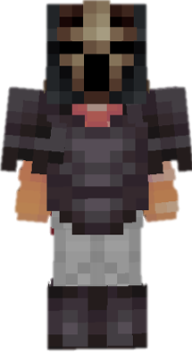

<table style="width: 100%">
    <tr>
        <th style="text-align: center;font-size: 40px">Heavy Knight</th>
    </tr>
</table>

<table style="width: 100%">
    <tr>
        <th style="text-align: center;font-size: 30px;padding-top:2%">Description</th>
    </tr>
</table>

>No description provided.
  Archetype:<b> 💢 Damage</b>

 
<table style="width: 100%">
    <tr>
        <th style="text-align: center;font-size: 40px">Attributes</th>
    </tr>
</table>
<table style="width: 100%;">
  <tr>
    <th style="text-align: center;font-size: 25px">Health</th>
    <td style="text-align: center;color:red;font-size: 30px">♥ 100</td>
  </tr>
    <th style="text-align: center;font-size: 25px">Attack</th>
    <td style="text-align: center;color:darkred;font-size: 30px">🗡 100</td>
  <tr>
    <th style="text-align: center;font-size: 25px">Defence</th>
    <td style="text-align: center;color:green;font-size: 30px">🛡 150</td>
  </tr>
  <tr>
    <th style="text-align: center;font-size: 25px">Speed</th>
    <td style="text-align: center;color:red;font-size: 30px">
        🌊 80%
    </td>
  </tr>
  <tr>
    <th style="text-align: center;font-size: 25px">Crit Chance</th>
    <td style="text-align: center;color:red;font-size: 30px">
        ☢ 10%
    </td>
  </tr>
  <tr>
    <th style="text-align: center;font-size: 25px">Crit Damage</th>
    <td style="text-align: center;color:red;font-size: 30px">
        ☠ 50%
    </td>
  </tr>
  <tr>
    <th style="text-align: center;font-size: 25px">Attack Speed</th>
    <td style="text-align: center;color:red;font-size: 30px">
        ⚔ 25%
    </td>
  </tr>
</table>
 

<table style="width: 100%">
    <tr>
        <th style="text-align: center;font-size: 40px">Weapon</th>
    </tr>
</table>
<table style="width: 100%">
    <tr>
        <td style="text-align: center;font-size: 25px;color:green"><b>Basta</b>
        </td>
        <td>A royal claymore.
          <i>This thing was too big to be called a sword.</i>
          <b>Ability: Leap RIGHT CLICK</b>
          You won't take fall damage for a short time duration after leaping.
          Cooldown: 6s
        </td>
    </tr>
</table>

<table style="width: 100%">
    <tr>
        <th style="text-align: center;font-size: 40px">Talents</th>
    </tr>
</table>

---
<table style="width: 100%;">
  <tr>
    <th style="text-align: left;font-size: 30px;color:green">Uppercut</th>
    <th></th>
  </tr>
  <tr>
    <td style="text-align: left;color:gray;font-size: 25px">
        Impair Talent
         
        
            Perform an <u>uppercut</u> attack, <b>jumping</b> up with <b>enemies</b> in front you.
              Hit <b>enemiews</b> fall down <b>slowly</b>, <b>impairing</b> their movement.
        
    </td>
    <td style="text-align: left;color:gray;font-size: 25px;width:50%">
        Details
         
        
            Impair
             
                Weaken enemies by debuffing them.
             
             Cooldown: 6s
             Duration: 1s
             Point Generation: 1
             Range: 5
             Height: 3
             Damage: 5
        
    </td>
  </tr>

  <tr>
    <th style="text-align: left;font-size: 30px;color:green">Touchdown</th>
    <th></th>
  </tr>
  <tr>
    <td style="text-align: left;color:gray;font-size: 25px">
        Damage Talent
         
        
            While <u>airborne</u>, perform a devastating <b>plunging</b> attack, dealing <b>damage</b> upon <u>landing</u>.
              If there are <b>enemies</b> at the <u>same</u> <u>height</u> level as you, push them down.
        
    </td>
    <td style="text-align: left;color:gray;font-size: 25px;width:50%">
        Details
         
        
            Damage
             
                Deals damage to enemies.
             
             Cooldown: 8s
             Duration: 1.1s
             Point Generation: 1
             Radius: 4
             Plunge Radius: 5
             Plunge Damage: 7.5
             Max Plunging Time: 10s
        
    </td>
  </tr>

  <tr>
    <th style="text-align: left;font-size: 30px;color:green">Slash</th>
    <th></th>
  </tr>
  <tr>
    <td style="text-align: left;color:gray;font-size: 25px">
        Damage Talent
         
        
            Perform a <b>slash</b> attack in front of you, <b>damaging</b> and knocking all <b>enemies</b> in small AoE.
        
    </td>
    <td style="text-align: left;color:gray;font-size: 25px;width:50%">
        Details
         
        
            Damage
             
                Deals damage to enemies.
             
             Cooldown: 8s
             Point Generation: 1
             Distance: 3
             Effect Duration: 4s
             Damage: 6
             Strong Damage: 10
        
    </td>
  </tr>

  <tr>
    <th style="text-align: left;font-size: 30px;color:green">Perfect Sequence</th>
    <th></th>
  </tr>
  <tr>
    <td style="text-align: left;color:gray;font-size: 25px">
        Enhance Passive
         
        
            Using <b>Uppercut</b> > <b>Touchdown</b> > <b>Slash</b> in quick <u><b>succession</b></u> <b>empowers</b> and <u>resets</u> the cooldown of <b>Slash</b>
        
    </td>
    <td></td>
  </tr>

  <tr>
    <th style="text-align: left;font-size: 30px;color:green">Ultimate Sacrifice</th>
    <th></th>
  </tr>
  <tr>
    <td style="text-align: left;color:gray;font-size: 25px">
        Enhance Ultimate
         
        
            Instantly drop <u>all</u> your <b>armor</b> in exchange for more <b>power</b>, becoming a glass cannon.
        
    </td>
    <td style="text-align: left;color:gray;font-size: 25px;width:50%">
        Details
         
        
            Enhance
             
                Strengthen yourself for the battle.
             
             Duration: 3s
             Ultimate Cost: 60 ※
             Cast Duration: Instant
        
    </td>
  </tr>
</table>