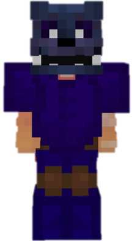

<table style="width: 100%">
    <tr>
        <th style="text-align: center;font-size: 40px">Nightmare</th>
    </tr>
</table>

<table style="width: 100%">
    <tr>
        <th style="text-align: center;font-size: 30px;padding-top:2%">Description</th>
    </tr>
</table>

>A spirit from the worst nightmares, blinds enemies and strikers from behind
  Archetype: 💢 <b>Damage</b>

 
<table style="width: 100%">
    <tr>
        <th style="text-align: center;font-size: 40px">Attributes</th>
    </tr>
</table>
<table style="width: 100%;">
  <tr>
    <th style="text-align: center;font-size: 25px">Health</th>
    <td style="text-align: center;color:red;font-size: 30px">♥ 100</td>
  </tr>
    <th style="text-align: center;font-size: 25px">Attack</th>
    <td style="text-align: center;color:darkred;font-size: 30px">🗡 100</td>
  <tr>
    <th style="text-align: center;font-size: 25px">Defence</th>
    <td style="text-align: center;color:green;font-size: 30px">🛡 100</td>
  </tr>
  <tr>
    <th style="text-align: center;font-size: 25px">Speed</th>
    <td style="text-align: center;color:red;font-size: 30px">
        🌊 100%
    </td>
  </tr>
  <tr>
    <th style="text-align: center;font-size: 25px">Crit Chance</th>
    <td style="text-align: center;color:red;font-size: 30px">
        ☢ 10%
    </td>
  </tr>
  <tr>
    <th style="text-align: center;font-size: 25px">Crit Damage</th>
    <td style="text-align: center;color:red;font-size: 30px">
        ☠ 50%
    </td>
  </tr>
  <tr>
    <th style="text-align: center;font-size: 25px">Attack Speed</th>
    <td style="text-align: center;color:red;font-size: 30px">
        ⚔ 100%
    </td>
  </tr>
</table>
 

<table style="width: 100%">
    <tr>
        <th style="text-align: center;font-size: 40px">Weapon</th>
    </tr>
</table>
<table style="width: 100%">
    <tr>
        <td style="text-align: center;font-size: 25px;color:green"><b>Oathbreaker</b>
        </td>
        <td style="text-align: center;font-size: 25px;width:55%;color:white">A sword that is capable of splitting dreams in half.
        </td>
    </tr>
</table>

<table style="width: 100%">
    <tr>
        <th style="text-align: center;font-size: 40px">Talents</th>
    </tr>
</table>

---
<table style="width: 100%;">
  <tr>
    <th style="text-align: left;font-size: 30px;color:green">Paranoia</th>
    <th></th>
  </tr>
  <tr>
    <td style="text-align: left;color:gray;font-size: 25px">
        Impair Talent
         
        
            Launch a cloud of darkness in fromnt of you thate travels forward, aplying <b>Omen</b> to Whoever it touches for <b>5s</b>.
              <b>Omen</b>:
             Enemies take more damage and suffer Paranoia
        
    </td>
    <td style="text-align: left;color:gray;font-size: 25px;width:50%">
        Details
         
        
            Impair
             
                Weaken enemies by debuffing them.
             
             Cooldown: 18s
             Duration: 5s
             Point Generation: 1
        
    </td>
  </tr>

  <tr>
    <th style="text-align: left;font-size: 30px;color:green">Shadow shift</th>
    <th></th>
  </tr>
  <tr>
    <td style="text-align: left;color:gray;font-size: 25px">
        Impair Talent
         
        
            Instantly teleport behind your target entity to scare them from behind, applying <b>Omen</b>.
              You will lose the ability to move for a short duration
        
    </td>
    <td style="text-align: left;color:gray;font-size: 25px;width:50%">
        Details
         
        
            Impair
             
                Weaken enemies by debuffin them.
             
             Cooldown: 10s
             Point Generation: 1
             Immobilization Duration: 1s
             Omen Duration: 3s
        
    </td>
  </tr>

  <tr>
    <th style="text-align: left;font-size: 30px;color:green">In the Shadows</th>
    <th></th>
  </tr>
  <tr>
    <td style="text-align: left;color:gray;font-size: 25px">
        Enhance Passive
         
        
            While in moody light, your 
            <b>🗡Attack</b> and 
            <b>🌊 Speed</b> increases.
        
    </td>
  </tr>

  <tr>
    <th style="text-align: left;font-size: 30px;color:green">Your Worst Nightmare</th>
    <th></th>
  </tr>
  <tr>
    <td style="text-align: left;color:gray;font-size: 25px">
        Impair Ultimate
         
        
            Applies the <b>Omen</b> to all living opponents for <b>12s</b>.
        
    </td>
    <td style="text-align: left;color:gray;font-size: 25px;width:50%">
        Details
         
        
            Impair
             
                Weaken enemies by debuffing them.
             
             Cooldown: 30s
             Duration: 12s
             Omen Damage Multiplier: 1.5
             Ultimate Cost: 55 ※
             Cast Duration: Instant
        
    </td>
  </tr>
</table>