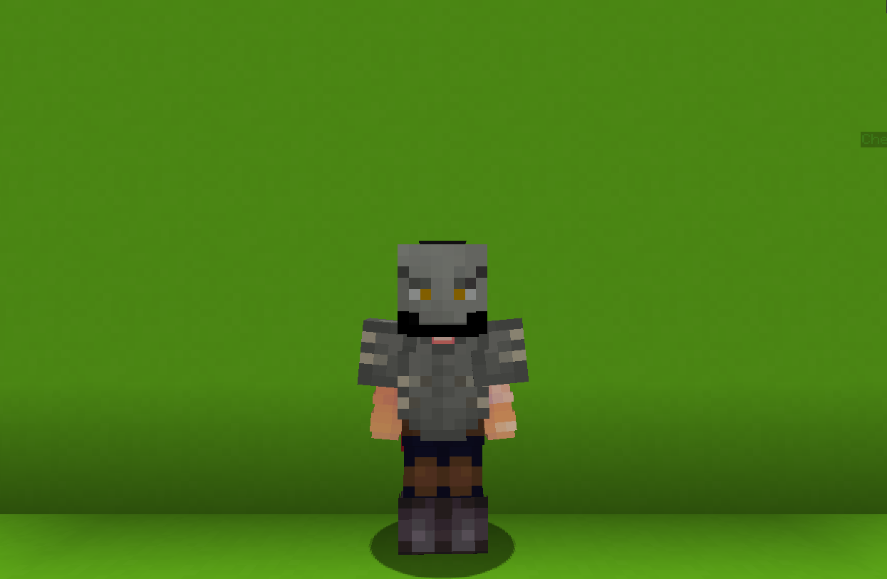

<table style="width: 100%">
    <tr>
        <th style="text-align: center;font-size: 40px">Pakarat Rakab (Orc)</th>
    </tr>
</table>

<table style="width: 100%">
    <tr>
        <th style="text-align: center;font-size: 30px;padding-top:2%">Description</th>
    </tr>
</table>

>Half-orc half-dwarf loner.
  Archetype:<b> 💢 Archetype</b>

 
<table style="width: 100%">
    <tr>
        <th style="text-align: center;font-size: 40px">Attributes</th>
    </tr>
</table>
<table style="width: 100%;">
  <tr>
    <th style="text-align: center;font-size: 25px">Health</th>
    <td style="text-align: center;color:red;font-size: 30px">♥ 125</td>
  </tr>
    <th style="text-align: center;font-size: 25px">Attack</th>
    <td style="text-align: center;color:darkred;font-size: 30px">🗡 100</td>
  <tr>
    <th style="text-align: center;font-size: 25px">Defence</th>
    <td style="text-align: center;color:green;font-size: 30px">🛡 60</td>
  </tr>
  <tr>
    <th style="text-align: center;font-size: 25px">Speed</th>
    <td style="text-align: center;color:red;font-size: 30px">
        🌊 110%
    </td>
  </tr>
  <tr>
    <th style="text-align: center;font-size: 25px">Crit Chance</th>
    <td style="text-align: center;color:red;font-size: 30px">
        ☢ 15%
    </td>
  </tr>
  <tr>
    <th style="text-align: center;font-size: 25px">Crit Damage</th>
    <td style="text-align: center;color:red;font-size: 30px">
        ☠ 50%
    </td>
  </tr>
  <tr>
    <th style="text-align: center;font-size: 25px">Attack Speed</th>
    <td style="text-align: center;color:red;font-size: 30px">
        ⚔ 60%
    </td>
  </tr>
  <tr>
    <th style="text-align: center;font-size: 25px">Effect Resistance</th>
    <td style="text-align: center;color:red;font-size: 30px">
        🐚 50%
    </td>
  </tr>
</table>
 

<table style="width: 100%">
    <tr>
        <th style="text-align: center;font-size: 40px">Weapon</th>
    </tr>
</table>
<table style="width: 100%">
    <tr>
        <td style="text-align: center;font-size: 25px;color:green"><b>Poleaxe</b>
        </td>
        <td >A sharp poleaxe.
          <b>Ability: Throuw RIGHT CLICK</b>
         Throw your poleaxe at your enemies!
          Upon hitting an <b>enemy</b>. it drastically <b>slows</b> them and deals <b>damage</b> before returning to you.
          Upon hitting a <b>block</b>. stay in a block for a while before returning to you.
          Cooldown: 15s
        </td>
    </tr>
</table>

<table style="width: 100%">
    <tr>
        <th style="text-align: center;font-size: 40px">Talents</th>
    </tr>
</table>

---
<table style="width: 100%;">
  <tr>
    <th style="text-align: left;font-size: 30px;color:green">Growl of a Beast</th>
    <th></th>
  </tr>
  <tr>
    <td style="text-align: left;color:gray;font-size: 25px">
        Impair Talent
         
        
            Growl with your <b>beautiful</b> and <b>dealy</b> voice, scaring enemies in moderate range, <b>impairing</b> and <b>slowing</b> them down.
        
    </td>
    <td style="text-align: left;color:gray;font-size: 25px;width:50%">
        Details
         
        
            Impair
             
                Weaken enemies by debuffing them.
             
             Cooldown: 20s
             Duration: 5s
             Point Generation: 2
             Debuf Duration: 6s
             Distance: 8
             Attack Decrease: 20
             Speed Decrease: 50
        
    </td>
  </tr>

  <tr>
    <th style="text-align: left;font-size: 30px;color:green">Axe</th>
    <th></th>
  </tr>
  <tr>
    <td style="text-align: left;color:gray;font-size: 25px">
        Input Talent
         
        
            Equip and prepare your axe for action.
              <b>LEFT CLICK to Spin</b>
             <i>Damage</i>
            Spin the axe. <b>damaging</b> and knocking
            enemies back.
              <b>RIGHT CLICK to Clash</b>
            <i>Damage</i>
            Dash forward, <b>damaging</b> the <u>first</u> hit <b>enemy</b>.
        
    </td>
    <td style="text-align: left;color:gray;font-size: 25px;width:50%">
        Details
         
        
            Damage
             
                Deals damage to enemies.
             
             Point Generation: 1
        
    </td>
  </tr>

  <tr>
    <th style="text-align: left;font-size: 30px;color:green">Don't Anger Me</th>
    <th></th>
  </tr>
  <tr>
    <td style="text-align: left;color:gray;font-size: 25px">
        Enhance Passive
         
        
            Taking <u>continuous</u> <b>damage</b> within the set time window will trigger <b>💢Berserk</b> for <b>3s</b>.
        
    </td>
    <td></td>
  </tr>

  <tr>
    <th style="text-align: left;font-size: 30px;color:green">Ultimate</th>
    <th></th>
  </tr>
  <tr>
    <td style="text-align: left;color:gray;font-size: 25px">
        Enhance Ultimate
         
        
            Enter <b>💢Berserk</b> for 15s.
              While active. gain:
            <b>• Increased 🗡 Attack.
            • Increased 🌊 Speed.
            • Increased ☢ Crit Chance.
            • —60 🛡 Defense.</b>
        
    </td>
    <td style="text-align: left;color:gray;font-size: 25px;width:50%">
        Details
         
        
            Enhance
             
                Strengthen yourself for the battle.
             
             Cooldown: 30s
             Duration: 15s
             Ultimate Cost: 70 ※
             Cast Duration: Instant
        
    </td>
  </tr>
</table>