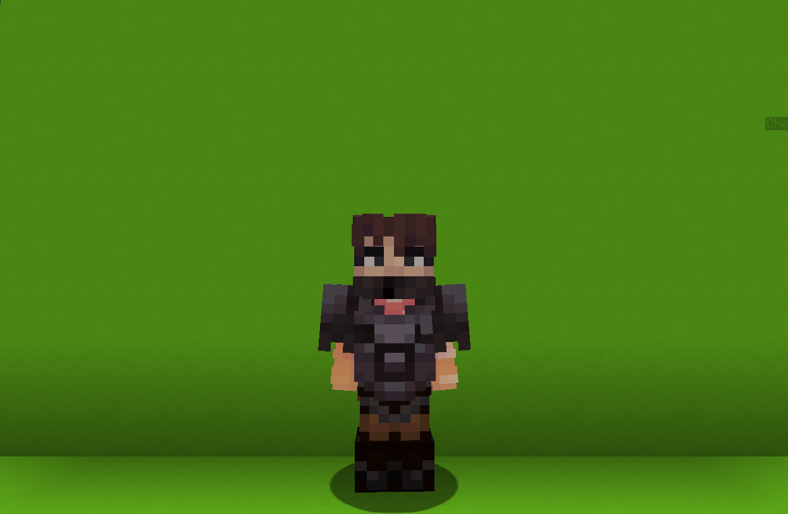

<table>
    <tr>
        <th>Rogue</th>
    </tr>
</table>

<table>
    <tr>
        <th>Description</th>
    </tr>
</table>

>The most selfish member of the mercenaries.
  Archetype:<b> 💢 Archetype</b>

 
<table>
    <tr>
        <th>Attributes</th>
    </tr>
</table>
<table>
  <tr>
    <th>Health</th>
    <td>♥ 60</td>
  </tr>
    <th>Attack</th>
    <td>🗡 100</td>
  <tr>
    <th>Defence</th>
    <td>🛡 100</td>
  </tr>
  <tr>
    <th>Speed</th>
    <td>🌊 130%</td>
  </tr>
  <tr>
    <th>Crit Chance</th>
    <td>☢ 10%</td>
  </tr>
  <tr>
    <th>Crit Damage</th>
    <td>☠ 50%</td>
  </tr>
  <tr>
    <th>Attack Speed</th>
    <td>⚔ 300%</td>
  </tr>
</table>
 

<table>
    <tr>
        <th>Weapon</th>
    </tr>
</table>
<table>
    <tr>
        <td><b>Sacrificial Dagger</b></td>
        <td>An ornate ceremonial dagger.
            Its small size allows for fast swings
        </td>
    </tr>
</table>

<table>
    <tr>
        <th>Talents</th>
    </tr>
</table>

---
<table>
  <tr>
    <th>Throwing Knife</th>
    <th></th>
  </tr>
  <tr>
    <td>
      Damage Talent
       Equip a <b>throwing knife</b>
        After a short <b>casting time</b>, throw it forward, <b>damaging</b> the first <b>enemmy</b> it hits and <b>impairing</b> their <b>movement</b>.
    </td>
    <td>
      Details
       Damage
       Deals damage to enemies.
        Cooldown: 12s
       Point Generation: 1
       Casting Time: 0.3s
       Max Flight Distance: 80
       Step: 1.8
       Damage: 15
       Speed Decrease: 75
       Impair Duration: 2s
    </td>
  </tr>

  <tr>
    <th>Swayblade</th>
    <th></th>
  </tr>
  <tr>
    <td>
      Impair Talent
       Hit all <b>enemies</b> in front of you with the <b>hilt</b> of your blade, <b>impairing</b> their vision.
    </td>
    <td>
      Details
       Impair
       Weaken enemies by debugging them.
        Cooldown: 4s
       Point Generation: 1
       Radius: 2.5 blocks
       Max Yaw Swift: 45
       Max Pitch Swift: 25
    </td>
  </tr>

  <tr>
    <th>Second Wind</th>
    <th></th>
  </tr>
  <tr>
    <td>
      Enhance Passive
       When taking <b>lethal damage</b>, instead of dying, gain <b>🦋 Second Wind</b> for short duration.
        <b>Second Wind</b>
       • Increases <b>🗡 Attack</b>.
       • Decreases <b>🔂 Cooldown Modifier</b>.
       • Creates a <b>shield</b>.
        If the <b>shield breaks</b> before duration ends, you <b>die</b>.
        If the <b>shield</b> has not expired after the duration ends, convert <b>200%</b> of remaining <b>shield</b> into <b>healing</b>.
    </td>
    <td></td>
  </tr>

  <tr>
    <th>Pipe Bomb</th>
    <th></th>
  </tr>
  <tr>
    <td>
      Damage Ultimate
       Toss a hand-made pipe bomb on front of you that <b>explodes</b> upon contact with an <b>enemy</b> or a <b>block</b>, dealing <b>damage</b> in moderate <b>AoE</b> and applies <b>Bleeding</b>.
        If at list <u>one</u> enemy was <b>hit</b>, refresh <b>🦋 Second Wind</b> chargees.
    </td>
    <td>
      Details
        Damage
       Deals damage to enemies
        Explosion Radius: 4
       Explosion Damage: 30
       Max Explosion Delay: 3s
       Magnitude: 0.8
       Y Magnitude: 0.2
       Bleed Duration: 3s
       Ultimate Cost: 60 ※
       Cast Duration: Instant
    </td>
  </tr>
</table>