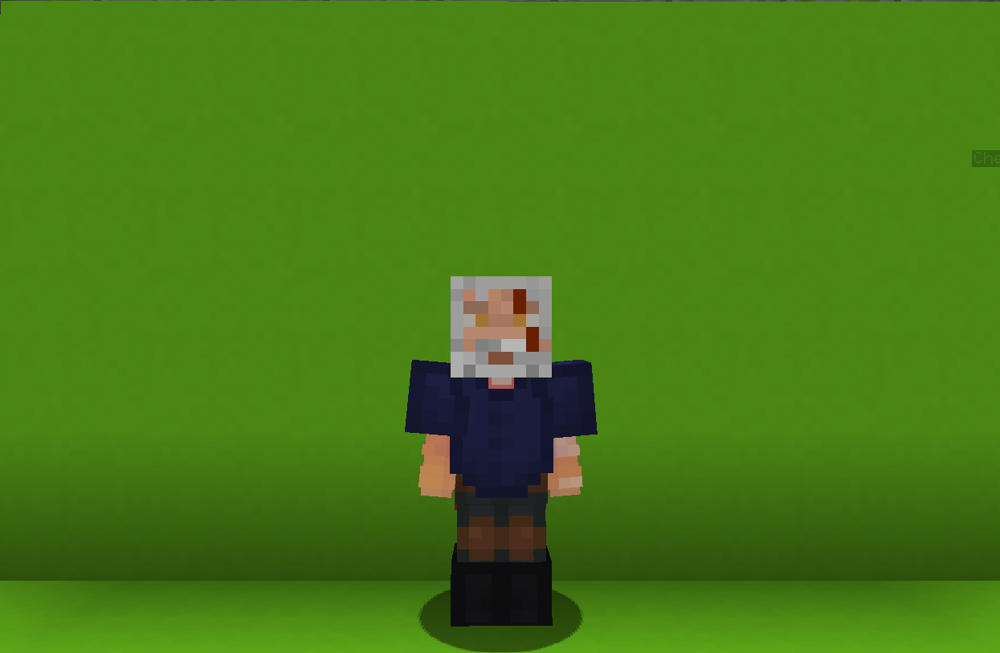

<table>
    <tr>
        <th>The Witcher</th>
    </tr>
</table>

<table>
    <tr>
        <th>Description</th>
    </tr>
</table>

>Some say that he's the most trained Witcher ever; Well in any kind of magic...
  Archetype: 💢<b>Damage</b>

 
<table>
    <tr>
        <th>Attributes</th>
    </tr>
</table>
<table>
  <tr>
    <th>Health</th>
    <td>♥ 100</td>
  </tr>
    <th>Attack</th>
    <td>🗡 100</td>
  <tr>
    <th>Defence</th>
    <td>🛡 100</td>
  </tr>
  <tr>
    <th>Speed</th>
    <td>🌊 100%</td>
  </tr>
  <tr>
    <th>Crit Chance</th>
    <td>☢ 10%</td>
  </tr>
  <tr>
    <th>Crit Damage</th>
    <td>☠ 50%</td>
  </tr>
  <tr>
    <th>Attack Speed</th>
    <td>⚔ 100%</td>
  </tr>
</table>
 

<table>
    <tr>
        <th>Weapon</th>
    </tr>
</table>
<table>
    <tr>
        <td><b>Aerondight</b></td>
        <td>Light, sharp as a razor, and fits the hand neatly</td>
    </tr>
</table>

<table>
    <tr>
        <th>Talents</th>
    </tr>
</table>

---
<table>
  <tr>
    <th>Aard</th>
    <th></th>
  </tr>
  <tr>
    <td>
        Impair Talent
         Creates a <u>small explosion</u> in front of you that <b>pushes enemies</b> away.
    </td>
    <td>
        Details
         Impair
         Weaken enemies by debuffing them.
          Cooldown: 5s
         Point Generation: 1
         Radius: 4
            
    </td>
  </tr>

  <tr>
    <th>Igni</th>
    <th></th>
  </tr>
  <tr>
    <td>
        Damage Talent
         FIre <b>blazing spirits</b> in front of you that deal <b>AoE damage</b> and set <b>enemies</b> on <b>fire</b>.
    </td>
    <td>
        Details
         Damage
         Deals damage to enemies.
          Cooldown: 10s
         Point Generation: 1
         Maximum Distance: 4
         Damage closest: 5
         Fire Duration Closest: 3s
         Damage Medium: 3.5
         Fire Ticks Medium: 2s
         Damage Further: 2
         Fire Ticks Further: 1s
    </td>
  </tr>
  
  <tr>
    <th>Quen</th>
    <th></th>
  </tr>
  <tr>
    <td>
        Defence Talent
         Applies <u>two charges</u> of Quen shield that <i>blocks</i> any damage.
    </td>
    <td>
        Details
         Defence
         Provides shields for yourself and allies.
          Cooldown: 30s
         Point Generation: 3
    </td>
  </tr>

  <tr>
    <th>Axii</th>
    <th></th>
  </tr>
  <tr>
    <td>
        Impair Talent
         Stun the <b>target</b> enemy for <b>5s</b> or until they <u>get</u> hit.
    </td>
    <td>
        Details
         Impair
         Weaken enemies by debuffing them.
          Cooldown: 40s
         Duration: 5s
         Point Generation: 3
    </td>
  </tr>

  <tr>
    <th>Yrden</th>
    <th></th>
  </tr>
  <tr>
    <td>
        Impair Talent
         Creates <b>Yrden</b> aura at your current location.
          <b>Enemies</b> <u>inside</u> the aura are <b>impaired</b> and aren't affected by <b>knockback</b>.
    </td>
    <td>
        Details
         Impair
         Weaken enemies by debuffing them.
          Cooldown: 25s
         Duration: 10s
         Point Generation: 2
         Radius: 3.5
         Defence Reduction: 0.5
         Speed Reduction: 0.0
         Impair Duration: 0.5s
    </td>
  </tr>

  <tr>
    <th>Combo</th>
    <th></th>
  </tr>
  <tr>
    <td>
        Enhance Passive
         Dealing <b>continuous damage</b> ti the <b>same target</b> will increase your combo.
          Greater combo hits deal <b>increase damage</b>.
    </td>
    <td></td>
  </tr>

  <tr>
    <th>All the Trainings</th>
    <th></th>
  </tr>
  <tr>
    <td>
        Enhance Ultimate
         Remember all your trainings and unleash them at once.
          Gaining a <b>🛡 Defence</b> incr4ease and the Yrden aura that follows you for <b>10s</b>.
         <i>After the duration ends, Quen and Yrden start their cooldown</i>
    </td>
    <td>
        Details
         Enhance
         Strengthen yourself for the battle.
          Cooldown: 10s
         Ultimate Cost: 80 ※
         Cast Duration: Instant
    </td>
  </tr>
</table>