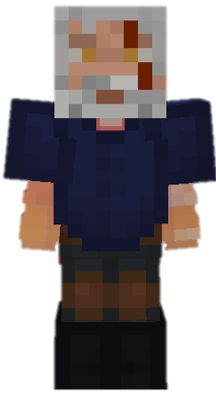

<table style="width: 100%">
    <tr>
        <th style="text-align: center;font-size: 40px">The Witcher</th>
    </tr>
</table>

<table style="width: 100%">
    <tr>
        <th style="text-align: center;font-size: 30px;padding-top:2%">Description</th>
    </tr>
</table>

>Some say that he's the most trained Witcher ever; Well in any kind of magic...
  Archetype: 💢 <b>Damage</b>

 
<table style="width: 100%">
    <tr>
        <th style="text-align: center;font-size: 40px">Attributes</th>
    </tr>
</table>
<table style="width: 100%;">
  <tr>
    <th style="text-align: center;font-size: 25px">Health</th>
    <td style="text-align: center;color:red;font-size: 30px">♥ 100</td>
  </tr>
    <th style="text-align: center;font-size: 25px">Attack</th>
    <td style="text-align: center;color:darkred;font-size: 30px">🗡 100</td>
  <tr>
    <th style="text-align: center;font-size: 25px">Defence</th>
    <td style="text-align: center;color:green;font-size: 30px">🛡 100</td>
  </tr>
  <tr>
    <th style="text-align: center;font-size: 25px">Speed</th>
    <td style="text-align: center;color:red;font-size: 30px">
        🌊 100%
    </td>
  </tr>
  <tr>
    <th style="text-align: center;font-size: 25px">Crit Chance</th>
    <td style="text-align: center;color:red;font-size: 30px">
        ☢ 10%
    </td>
  </tr>
  <tr>
    <th style="text-align: center;font-size: 25px">Crit Damage</th>
    <td style="text-align: center;color:red;font-size: 30px">
        ☠ 50%
    </td>
  </tr>
  <tr>
    <th style="text-align: center;font-size: 25px">Attack Speed</th>
    <td style="text-align: center;color:red;font-size: 30px">
        ⚔ 100%
    </td>
  </tr>
</table>
 

<table style="width: 100%">
    <tr>
        <th style="text-align: center;font-size: 40px">Weapon</th>
    </tr>
</table>
<table style="width: 100%">
    <tr>
        <td style="text-align: center;font-size: 25px;color:green"><b>Aerondight</b>
        </td>
        <td style="text-align: center;font-size: 25px;width:55%;color:white">Light, sharp as a razor, and fits the hand neatly
        </td>
    </tr>
</table>

<table style="width: 100%">
    <tr>
        <th style="text-align: center;font-size: 40px">Talents</th>
    </tr>
</table>

---
<table style="width: 100%;">
  <tr>
    <th style="text-align: left;font-size: 30px;color:green">Aard</th>
    <th></th>
  </tr>
  <tr>
    <td style="text-align: left;color:gray;font-size: 25px">
        Impair Talent
         
        
            Creates a <u>small explosion</u> in front of you that <b>pushes enemies</b> away.
        
    </td>
    <td style="text-align: left;color:gray;font-size: 25px;width:50%">
        Details
         
        
            Impair
             
                Weaken enemies by debuffing them.
             
             Cooldown: 5s
             Point Generation: 1
             Radius: 4
               
        
    </td>
  </tr>

  <tr>
    <th style="text-align: left;font-size: 30px;color:green">Igni</th>
    <th></th>
  </tr>
  <tr>
    <td style="text-align: left;color:gray;font-size: 25px">
        Damage Talent
         
        
            FIre <b>blazing spirits</b> in front of you that deal <b>AoE damage</b> and set <b>enemies</b> on <b>fire</b>.
        
    </td>
    <td style="text-align: left;color:gray;font-size: 25px;width:50%">
        Details
         
        
            Damage
             
                Deals damage to enemies.
             
             Cooldown: 10s
             Point Generation: 1
             Maximum Distance: 4
             Damage closest: 5
             Fire Duration Closest: 3s
             Damage Medium: 3.5
             Fire Ticks Medium: 2s
             Damage Further: 2
             Fire Ticks Further: 1s
        
    </td>
  </tr>
  
  <tr>
    <th style="text-align: left;font-size: 30px;color:green">Quen</th>
    <th></th>
  </tr>
  <tr>
    <td style="text-align: left;color:gray;font-size: 25px">
        Defence Talent
         
        
            Applies <u>two charges</u> of Quen shield that <i>blocks</i> any damage.
        
    </td>
    <td style="text-align: left;color:gray;font-size: 25px;width:50%">
        Details
         
        
            Defence
             
                Provides shields for yourself and allies.
             
             Cooldown: 30s
             Point Generation: 3
        
    </td>
  </tr>

  <tr>
    <th style="text-align: left;font-size: 30px;color:green">Axii</th>
    <th></th>
  </tr>
  <tr>
    <td style="text-align: left;color:gray;font-size: 25px">
        Impair Talent
         
        
            Stun the <b>target</b> enemy for <b>5s</b> or until they <u>get</u> hit.
        
    </td>
    <td style="text-align: left;color:gray;font-size: 25px;width:50%">
        Details
         
        
            Impair
             
                Weaken enemies by debuffing them.
             
             Cooldown: 40s
             Duration: 5s
             Point Generation: 3
        
    </td>
  </tr>

  <tr>
    <th style="text-align: left;font-size: 30px;color:green">Yrden</th>
    <th></th>
  </tr>
  <tr>
    <td style="text-align: left;color:gray;font-size: 25px">
        Impair Talent
         
        
            Creates <b>Yrden</b> aura at your current location.
        
          <b>Enemies</b> <u>inside</u> the aura are <b>impaired</b> and aren't affected by <b>knockback</b>.
    </td>
    <td style="text-align: left;color:gray;font-size: 25px;width:50%">
        Details
         
        
            Impair
             
                Weaken enemies by debuffing them.
             
             Cooldown: 25s
             Duration: 10s
             Point Generation: 2
             Radius: 3.5
             Defence Reduction: 0.5
             Speed Reduction: 0.0
             Impair Duration: 0.5s
        
    </td>
  </tr>

  <tr>
    <th style="text-align: left;font-size: 30px;color:green">Combo</th>
    <th></th>
  </tr>
  <tr>
    <td style="text-align: left;color:gray;font-size: 25px">
        Enhance Passive
         
        
            Dealing <b>continuous damage</b> ti the <b>same target</b> will increase your combo.
              Greater combo hits deal <b>increase damage</b>.
        
    </td>
  </tr>

  <tr>
    <th style="text-align: left;font-size: 30px;color:green">All the Trainings</th>
    <th></th>
  </tr>
  <tr>
    <td style="text-align: left;color:gray;font-size: 25px">
        Enhance Ultimate
         
        
            Remember all your trainings and unleash them at once.
              Gaining a <b>🛡 Defence</b> incr4ease and the Yrden aura that follows you for <b>10s</b>.
             <i>After the duration ends, Quen and Yrden start their cooldown</i>
        
    </td>
    <td style="text-align: left;color:gray;font-size: 25px;width:50%">
        Details
         
        
            Enhance
             
                Strengthen yourself for the battle.
             
             Cooldown: 10s
             Ultimate Cost: 80 ※
             Cast Duration: Instant
        
    </td>
  </tr>
</table>