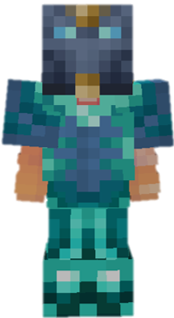

<table style="width: 100%">
    <tr>
        <th style="text-align: center;font-size: 40px">Zealot</th>
    </tr>
</table>

<table style="width: 100%">
    <tr>
        <th style="text-align: center;font-size: 30px;padding-top:2%">Description</th>
    </tr>
</table>

>A space ranger with a single goal of maintaining order.
  Archetype:<b> 💢 Archetype</b>

 
<table style="width: 100%">
    <tr>
        <th style="text-align: center;font-size: 40px">Attributes</th>
    </tr>
</table>
<table style="width: 100%;">
  <tr>
    <th style="text-align: center;font-size: 25px">Health</th>
    <td style="text-align: center;color:red;font-size: 30px">♥ 100</td>
  </tr>
    <th style="text-align: center;font-size: 25px">Attack</th>
    <td style="text-align: center;color:darkred;font-size: 30px">🗡 100</td>
  <tr>
    <th style="text-align: center;font-size: 25px">Defence</th>
    <td style="text-align: center;color:green;font-size: 30px">🛡 100</td>
  </tr>
  <tr>
    <th style="text-align: center;font-size: 25px">Speed</th>
    <td style="text-align: center;color:red;font-size: 30px">
        🌊 100%
    </td>
  </tr>
  <tr>
    <th style="text-align: center;font-size: 25px">Crit Chance</th>
    <td style="text-align: center;color:red;font-size: 30px">
        ☢ 10%
    </td>
  </tr>
  <tr>
    <th style="text-align: center;font-size: 25px">Crit Damage</th>
    <td style="text-align: center;color:red;font-size: 30px">
        ☠ 50%
    </td>
  </tr>
  <tr>
    <th style="text-align: center;font-size: 25px">Ferocity</th>
    <td style="text-align: center;color:red;font-size: 30px">
        🌀 50%
    </td>
  </tr>
  <tr>
    <th style="text-align: center;font-size: 25px">Attack Speed</th>
    <td style="text-align: center;color:red;font-size: 30px">
        ⚔ 100%
    </td>
  </tr>
</table>
 

<table style="width: 100%">
    <tr>
        <th style="text-align: center;font-size: 40px">Weapon</th>
    </tr>
</table>
<table style="width: 100%">
    <tr>
        <td style="text-align: center;font-size: 25px;color:green"><b>Psionic Blade</b>
        </td>
        <td style="text-align: center;font-size: 25px;width:55%;color:white">
          An ordinary space katana.
            <b>Ability: Soul Cry RIGHT CLICK</b>
           Gain <b>100 🌀 Ferocity</b> and <b>🌊 Speed</b> for <b>3s</b>.
        </td>
    </tr>
</table>

<table style="width: 100%">
    <tr>
        <th style="text-align: center;font-size: 40px">Talents</th>
    </tr>
</table>

---
<table style="width: 100%;">
  <tr>
    <th style="text-align: left;font-size: 30px;color:green">Broken Heart Radiation</th>
    <th></th>
  </tr>
  <tr>
    <td style="text-align: left;color:gray;font-size: 25px">
        Impair Talent
         
        
            Create four radiation beams that spin around you for <b>3s</b>.
              If a beam touches an enemy, it deals <b>10 ♥</b> damage and reduces <b>🩸 Vitality</b> by <b>25%</b> and <b>🛡 Defence</b> by <b>33%</b> for <b>12.5s</b>.
        
    </td>
    <td style="text-align: left;color:gray;font-size: 25px;width:50%">
        Details
         
        
            Impair
             
                Weaken enemies by deuffing them.
             
             Cooldown: 20s
             Duration: 3s
             Point Generation: 2
             Beam Length: 4
             Beam Damage: 10
             Mending Reduction: 25%
             Defence Reduction: 33%
             Effect Duration: 12.5s
        
    </td>
  </tr>

  <tr>
    <th style="text-align: left;font-size: 30px;color:green">Malevolent Hitshield</th>
    <th></th>
  </tr>
  <tr>
    <td style="text-align: left;color:gray;font-size: 25px">
        Defence Talent
         
        
            Gain a <b>shield</b> for <b>7</b> hits, reduced on hit <u>regardless</u> of damage.
        
    </td>
    <td style="text-align: left;color:gray;font-size: 25px;width:50%">
        Details
         
        
            Defence
             
                Provide shields for yourself or allies.
             
             Point Generation: 1
             Shield Strength: 7
             Cooldown: 30s
        
    </td>
  </tr>

  <tr>
    <th style="text-align: left;font-size: 30px;color:green">Ferocious Strikes</th>
    <th></th>
  </tr>
  <tr>
    <td style="text-align: left;color:gray;font-size: 25px">
        Enhance Passive
         
        
            Each time you <u>score</u> a <u>🌀 Ferocity</u> attack, gain a <b>🌀 Ferocious Strike</b> stack.
               Each <b>🌀 Ferocious Strike</b> stack will <u>improve</u> your <b>ultimate damage<b>.
        
    </td>
    <td></td>
  </tr>

  <tr>
    <th style="text-align: left;font-size: 30px;color:green">Maintain Order</th>
    <th></th>
  </tr>
  <tr>
    <td style="text-align: left;color:gray;font-size: 25px">
        Damage Ultimate
         
        
            Command a <b>giant sword</b> to <b>fall down</b> from the <b>sky</b>.
              Upon landing, <b>explodes</b> violently, inflicting <b>🌀 Ferocity</b> on nearby <b>enemies</b> based on your <b>🌀 Ferocious Strike</b> stacks
        
    </td>
    <td style="text-align: left;color:gray;font-size: 25px;width:50%">
        Details
         
        
            Damage
             
                Deals damage to enemies
             
             Duration: 12s
             Base Damage: 4
             Landing Offset: 10
             Distance: 5
             Impact Time: 0.8s
             Direction Offset: 2.5s
             Landing Speed: 0.2s
             ultimate Cost: 60 ※
             Cast Duration: Instant
        
    </td>
  </tr>
</table>