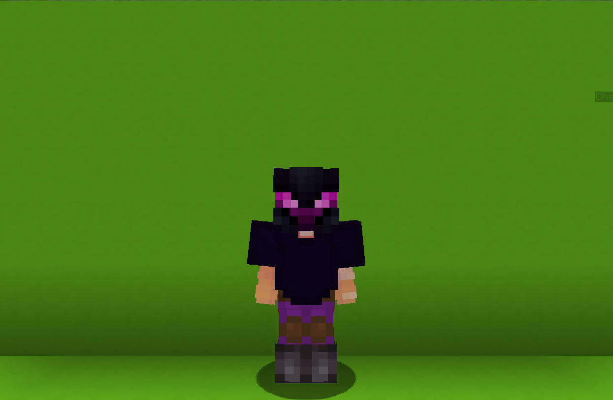

<table>
    <tr>
        <th>Blast Knight</th>
    </tr>
</table>

<table>
    <tr>
        <th>Description</th>
    </tr>
</table>

>A royal knight with high-end technology gadgets.
  Archetype:<b> 🛡 Defence</b>

 
<table>
    <tr>
        <th>Attributes</th>
    </tr>
</table>
<table>
    <tr>
        <th>Health</th>
        <td>♥ 100</td>
    </tr>
        <th>Attack</th>
        <td>🗡 100</td>
    <tr>
        <th>Defence</th>
        <td>🛡 150</td>
    </tr>
    <tr>
        <th>Speed</th>
        <td>🌊 100%</td>
    </tr>
    <tr>
        <th>Crit Chance</th>
        <td>☢ 10%</td>
    </tr>
    <tr>
        <th>Crit Damage</th>
        <td>☠ 50%</td>
    </tr>
    <tr>
        <th>Attack Speed</th>
        <td>⚔ 100%</td>
    </tr>
</table>
 

<table>
    <tr>
        <th>Weapon</th>
    </tr>
</table>
<table>
    <tr>
        <td><b>Royal Sword</b></td>
        <td>A royal sword, forged of the best quality ore possible.</td>
    </tr>
</table>

<table>
    <tr>
        <th>Talents</th>
    </tr>
</table>

---
<table>
    <tr>
        <th>Castle of Stone</th>
        <th></th>
    </tr>
    <tr>
        <td>
            Defence Talent
             Erect a castle of stone at your currentlocation.
              When a <b>teammate</b> <u><b>within</b></u> the castle takes
            <b>damage</b>. the damage is <b>split</b> between you.
              You also receive a <b>🛡 Defense</b>, <b>🦏Knockback
            Resistance</b> and <b>🐚 Effect Resistance</b> increase.
        </td>
      <td>
          Details
           Defence
           Provide shields for yourself or allies.
            Cooldown: 10s
           Duration: 12s
           Point Generation: 1
           Defence Increase: 150%
           Kb Resistance Increase: 50%
           Cc Resistance Increase: 50%
           Distance: 8
           Damage Split: 70%/30%
      </td>
    </tr>
    <tr>
        <th>Quantum Discharge</th>
        <th></th>
    </tr>
    <tr>
        <td>
            Damage Talent
             Spend all <b>Quantuum Energy</b> to lainch a <b>device</b> that charges overtime.
              Once charged, create <b>Nova Explosion</b> that deals <b>AoE damage</b> and knocks enemies back.
        </td>
        <td>
            Details
             Damage
             Deals damage to enemies.
              Cooldown: 20s
             Point Generation: 2
             Min Charges to Discharge: 3
             Discharge Dekay Per Shield Charge: 0.1s
             Damage Per Shield Charge: 3
             Explosion Radius: 10
             Shielld Cooldown Per Charge: 4s
        </td>
    </tr>
    <tr>
        <th>Quantum Energy</th>
        <th></th>
    </tr>
    <tr>
        <td>
            Enhance Passive
             <b>Blocking</b> damage with your <b>shield</b> wiill accumulate <b>Quantum Energy</b>.
              Using <b>Quantum Discharge</b> can manipulate the energy to create <b>Nova Explosion</b>.
        </td>
        <td></td>
    </tr>
    <tr>
        <th>Nanite Rush</th>
        <th></th>
    </tr>
    <tr>
        <td>
            Support Ultimate
             Instantly release an <b>Nanite Swarm</b> that <b>rushes</b> upwards, creating a <b>shield</b> and rapidly <b>regenerates</b> all existing sheilds.
        </td>
        <td>
            Details
             Support
             Provide buffs to teammates.
              Cooldown: 30s
             Duration: 1.5s
             Ultimate Radius: 7
             Initial Shield Capacity: 10
             Shield Capacity: 50
             Ultimate Cost: 60 ※
             Cast Duration: Instant
        </td>
    </tr>
</table>