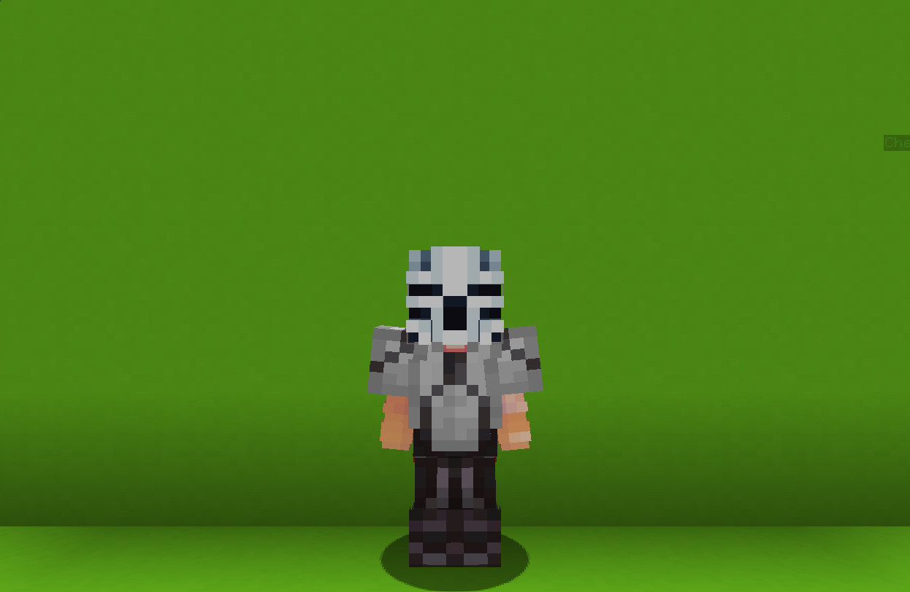

<table>
    <tr>
        <th>Cryptshade</th>
    </tr>
</table>

<table>
    <tr>
        <th>Description</th>
    </tr>
</table>

>Anonymous hacker, who hacked his way to the fight. Specializes in locking enemies abilities.
  Archetype:<b> 🕷 Hexbane</b>

 
<table>
    <tr>
        <th>Attributes</th>
    </tr>
</table>
<table>
    <tr>
        <th>Health</th>
        <td>♥ 100</td>
    </tr>
        <th>Attack</th>
        <td>🗡 100</td>
    <tr>
        <th>Defence</th>
        <td>🛡 100</td>
    </tr>
    <tr>
        <th>Speed</th>
        <td>🌊 110%</td>
    </tr>
    <tr>
        <th>Crit Chance</th>
        <td>☢ 10%</td>
    </tr>
    <tr>
        <th>Crit Damage</th>
        <td>☠ 50%</td>
    </tr>
    <tr>
        <th>Attack Speed</th>
        <td>⚔ 100%</td>
    </tr>
</table>
 

<table>
    <tr>
        <th>Weapon</th>
    </tr>
</table>
<table>
    <tr>
        <td><b>Nano Sword</b></td>
        <td></td>
    </tr>
</table>

<table>
    <tr>
        <th>Talents</th>
    </tr>
</table>

---
<table>
    <tr>
        <th>Saboteur</th>
        <th></th>
    </tr>
    <tr>
        <td>
            Impair Talent
             Equip a <b>hacking device</b>; after a short <b>casting time</b>, hack all <b>opponents</b> in front of you, <b>implanting</b> a random <b>🐜 Disruptive Bug</b> onto them.
              <b>Bugs:</b>
             Decreases 🗡 Attack.
             Decreases 🛡 Defence.
             Decreases 🌊 Speed.
              This ability can also hack <b>Supply Packs</b>, rendering them <b>unobtainable</b> for <u>you</u> or your <u>teammates</u> but <b>impairing</b> and <b>implanting</b> a random <b>bug</b> onto an <b>enemy</b> when they pick it up.
        </td>
      <td>
          Details
           Impair
           Weaken enemies by debuffing them.
            Cooldown: 12s
           Point Generation: 1
           Hack Distance: 5
           Hacked Supply Damage: 10
           Hacked supply Attack Reduction: 25
           Hacked Supply Seed Reduction: 30
           Impair Duration: 5s
      </td>
    </tr>
    <tr>
        <th>Cipher Lock</th>
        <th></th>
    </tr>
    <tr>
        <td>
            Impair Talent
             Equip a <b>hacking device</b>; after a short <b>casting time</b>, launch an <b>energy blast</b> in front of you.
              The energy <b>travels forward</b> until it hits an <b>enemy</b> or a <b>block</b>.
              Upon hitting an <b>enemy</b>, <b>impair</b> them and <b>lock</b> a random <b>talent</b> for <b>15s</b>.
        </td>
        <td>
            Details
             Impair
             Weaken enemies by debuffing them.
              Cooldown: 20s
             Point Generation: 2
             Max Flight Time: 60
             Impair Duration: 15s
        </td>
    </tr>
    <tr>
        <th>Neural Theft</th>
        <th></th>
    </tr>
    <tr>
        <td>
            Impair Passive
             At <b>intervals</b>, <b>hack</b> all <b>bugged</b> opponents and send the data to <u>you</u> and <u>your</u> teammates.
              The data includes:
             L Enemy's <b>location</b>
             L Enemy's <b>♥ Health</b>
             L Enemy's <b>✖ Energy</b>
              Also, <b>steal</b> a small amount of <b>✖ Energy</b> from each hacked enemy.
        </td>
        <td></td>
    </tr>
    <tr>
        <th>Lockdown</th>
        <th></th>
    </tr>
    <tr>
        <td>
            Impair Ultimate
             Equip a <b>hacking device</b>; after a <u>long</u> <b>casting time</b>, <b>overload</b> all implanted <b>🐜 Disruptive Bugs</b>,
              <b>Overloading</b> the <b>bugs implodes</b> them, causing affected enemies' <b>talents</b> to be <b>locked</b>.
             <i>Overloading bugs causes them to break.</i>
              In addition. all <b>enemies lose</b> <u>half</u> of their <b>✖ Energy</b>.
        </td>
        <td>
            Details
             Impair
             Weaken enemies by debuffing them.
              Cooldown: 30s
             Lockdown Talent Lock Duration: 30s
             Ultimate Distance: 20
             Ultimate Cost: 100 ※
             Cast Duration: Instant
        </td>
    </tr>
</table>