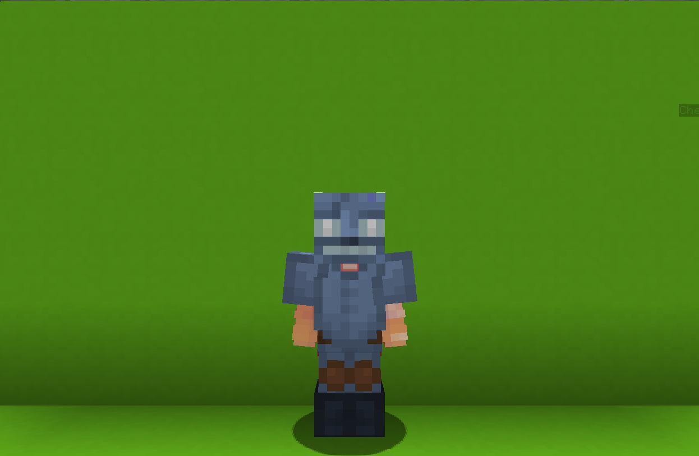

<table>
    <tr>
        <th>Frostbite</th>
    </tr>
</table>

<table>
    <tr>
        <th>Description</th>
    </tr>
</table>

>A very cold entity to the touch.
  Archetype:<b> 🕷1 Hexbane</b>

 
<table>
    <tr>
        <th>Attributes</th>
    </tr>
</table>
<table>
    <tr>
        <th>Health</th>
        <td>♥ 100</td>
    </tr>
        <th>Attack</th>
        <td>🗡 100</td>
    <tr>
        <th>Defence</th>
        <td>🛡 100</td>
    </tr>
    <tr>
        <th>Speed</th>
        <td>🌊 100%</td>
    </tr>
    <tr>
        <th>Crit Chance</th>
        <td>☢ 10%</td>
    </tr>
    <tr>
        <th>Crit Damage</th>
        <td>☠ 50%</td>
    </tr>
    <tr>
        <th>Attack Speed</th>
        <td>⚔ 100%</td>
    </tr>
</table>
 

<table>
    <tr>
        <th>Weapon</th>
    </tr>
</table>
<table>
    <tr>
        <td><b>Snow Shovel</b></td>
        <td>
            An ordinary shovel used for shoveling the snow.
              <b>Ability: Shoot! RI6HT CLICK</b>
             Shoot your weapon.
              <b>Ability: Reload! LEFT CLICK</b>
             Reload your weapon manually.
              ATTRIBUTES:
             FIRE RRTE: 1.2s
             MRX OISTRNCE: 40.0
             ORMRGE: 5.0
             MRX RMMO: 4
             RELORO TIME: 4s
        </td>
    </tr>
</table>

<table>
    <tr>
        <th>Talents</th>
    </tr>
</table>

---
<table>
    <tr>
        <th>Frostfall</th>
        <th></th>
    </tr>
    <tr>
        <td>
            Impair Talent
             Summon a bunch of icicles at your target enemmy.
             <i>If there are no target enemies, the icicles will spawn in fromnt of you.</i>
              After a short delay, the icicles fall down, dealing AoE damage and:
             - Decreases ☢Crit Chance by 25%.
             - Decreases ☠Crit Damage by 50%.
             - Decreases 🗡Attack by 15%.
        </td>
      <td>
          Details
           Impair
           Weaken enemies by debuffing them.
            Cooldown: 12s
           Point Generation: 1
           Distance: 4
           Damage: 5
           Crit Chance Reduction: 25%
           Crit Damage Reduction: 50%
           Attack Reduction: 15%
           Debuff Duration: 10s
      </td>
    </tr>
    <tr>
        <th>Ice Cage</th>
        <th></th>
    </tr>
    <tr>
        <td>
            Impair Talent
             Launch a snowball in front of you.
               Upon hitting an entity, immobilize and cage them in ice.
        </td>
        <td>
            Details
             Impair
             Weaken enemies by debuffing them.
              Cooldown: 20s
             Duration: 6s
             Point Generation: 2
        </td>
    </tr>
    <tr>
        <th>Chill Aura</th>
        <th></th>
    </tr>
    <tr>
        <td>
            Enhance Passive
             You emmit a <b>chill aura</b>, that <b>slows</b> and decreases enemoes <b>⚔ Attack Speed</b> in small AoE.
        </td>
        <td></td>
    </tr>
    <tr>
        <th>Eternal Freeze</th>
        <th></th>
    </tr>
    <tr>
        <td>
            Impair Ultimate
             Unleash the <b>Eternal Freeze</b> upon your enemies, creating a massive <b>snow field</b> that <b>debuffs</b> enemies.
              The field orbits around for <b>10s</b>:
             - <b>Decreasing</b> enemies <b>☢Crit Chance</b> and <b>☠Crit Damage</b>.
             - <b>Slowing</b> and <b>impairing</b> vision.
             - Increasing cooldowns.
        </td>
        <td>
            Details
             Impair
             Weaken enemies by debuffing them.
              Duration: 10s
             Block Count: 1.2s
             Distance: 10
             Crit Chance Reduction: 1
             Crit Damage Reduction: 1
             Cooldown Increase: 0.5
             Debuff Duration: 1s
             Ultimate Cost: 60 ※
             Cast Duration: Instant
        </td>
    </tr>
</table>