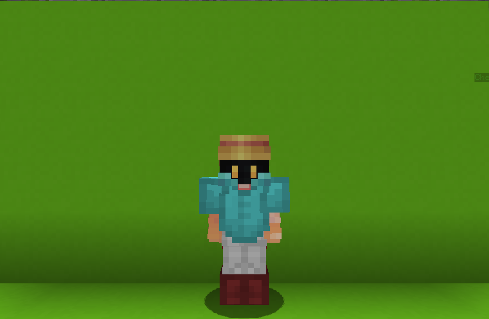

<table>
    <tr>
        <th>Dark Mage</th>
    </tr>
</table>

<table>
    <tr>
        <th>Description</th>
    </tr>
</table>

>A nage who was cursed by the Dark Magic, but even it couldn't kill him...
  Archetype:<b> 🌟 Magic</b>

 
<table>
    <tr>
        <th>Attributes</th>
    </tr>
</table>
<table>
    <tr>
        <th>Health</th>
        <td>♥ 100</td>
    </tr>
        <th>Attack</th>
        <td>🗡 100</td>
    <tr>
        <th>Defence</th>
        <td>🛡 100</td>
    </tr>
    <tr>
        <th>Speed</th>
        <td>🌊 100%</td>
    </tr>
    <tr>
        <th>Crit Chance</th>
        <td>☢ 15%</td>
    </tr>
    <tr>
        <th>Crit Damage</th>
        <td>☠ 50%</td>
    </tr>
    <tr>
        <th>Attack Speed</th>
        <td>⚔ 100%</td>
    </tr>
</table>
 

<table>
    <tr>
        <th>Weapon</th>
    </tr>
</table>
<table>
    <tr>
        <td><b>Ancient Wand</b></td>
        <td>An ancient item capable of casting the darkest of spells...
          <b>Ability; Spell RIGHT CLICK</b>
         Enter runic spell mode.
          While in this mode. combine <b>L</b> and <b>R</b>
        runes using <u><b>left</b></u> and <u><b>right</b></u> clicks respectively.
          Successfully combining two runes will <b>cast</b> the <b>corresponding</b> spell.</td>
    </tr>
</table>

<table>
    <tr>
        <th>Talents</th>
    </tr>
</table>

---
<table>
    <tr>
        <th>Darkness Curse</th>
        <th></th>
    </tr>
    <tr>
        <td>
            Impair Talent
             Impair the target enemy. dealing damage, blinding and slowing them.
              <b>Witherborn Assist</b>
             The curse bounces to two additional targets.
             <b>Usage: R -> R</b> 
              <i>You must use your wand to cast this spell!</i>
        </td>
      <td>
          Details
           Damage
           Deals damage to enemies.
            Cooldown: 10s
           Point Generation: 1
           Max Distance: 35
           Damage: 7.5
           Blinding Duration: 2s
           Slowing Duration: 2s
      </td>
    </tr>
    <tr>
        <th>Slowing Aura</th>
        <th></th>
    </tr>
    <tr>
        <td>
            Impair Talent
             Creates a <b>slowness pool</b> at your <b>target</b> block that slows enemies.
              <i>The aura dows not slow its creator.</i>
              <b>Witherborn Assist</b>
             The aura will also increase <b>🔂 Cooldown Modifier</b> and periodicaly <b>interrupt</b> actions.
              <b>Usage: R -> L</b>
              <i>You must use youer wand to cast this spell!</i>
        </td>
        <td>
            Details
             Impair
             Weaken enemies by debuffing them.
              Cooldown: 10s
             Duration: 4s
             Point Generation: 1
             Max Distance: 20 blocks
             Radius: 4
             Cd Increase: 0.5
        </td>
    </tr>
    <tr>
        <th>Healing Aura</th>
        <th></th>
    </tr>
    <tr>
        <td>
            Support Talent
             Create a healing circle at your location that periodically heals all nearby players.
              <b>Witherborn Assist</b>
             Instantly heal for 25 ♥.
             <b>Usage: L -> L</b>
              <i>You must use youer wand to cast this spell!</i>
        </td>
        <td>
            Details
             Support
             Provide buffs to teammeates.
              Cooldown: 30s
             Duration: 10s
             Point Generation: 3
             Radius: 2.5 blocks
             Healing: 2
             Assist Healing: 25
             Healing Period: 0.8s
        </td>
    </tr>
    <tr>
        <th>Shadow Clone</th>
        <th></th>
    </tr>
    <tr>
        <td>
            Impair Talent          
             Create a reflection of yourself at your current location and become invisible.
              After a brief delay or whenever the clone is damaged. it explodes, damaging and impairing nearby enemies.
              <b>Witherborn Assist</b>
             The clone will persist until you take
            damage. nullifying the damage and teleporting
            you to its location.
              <b>Usage: L -> R</b> 
              <i>You must use youer wand to cast this spell!</i>
        </td>
        <td>
            Details
             Impair
             Weaken enemies by debuffing them.
              Cooldown: 15s
             Duration: 3s
             Point Generation: 1
             Damage Radius: 3 blocks
             Damage: 3
        </td>
    </tr>
    <tr>
        <th>Wither Blood</th>
        <th></th>
    </tr>
    <tr>
        <td>
            Impair Passive
             Upon taking <b>damage</b>, there is a small chance to <b>wither</b> the attacker.
        </td>
        <td></td>
    </tr>
    <tr>
        <th>Witherborn</th>
        <th></th>
    </tr>
    <tr>
        <td>
            Enhance Ultimate
             Raised by the WIthers, they will always assist you in battle.
              While attacking, the Wither will unleash a coordinated attack.
              While casting a spell, it will be improved and th cooldown is reduced.
              After 12s, the Wither will leave.
        </td>
        <td>
            Details
             Enhance
             Stregthen yourseld for the battle.
              Cooldown: 30s
             Duration: 12s
             Assist Delay: 2000
             Assist Hits: 3
             Assist Damage: 10.0
             Ultimate Cost: 60 ※
             Cast Duration: Instant
        </td>
    </tr>
</table>