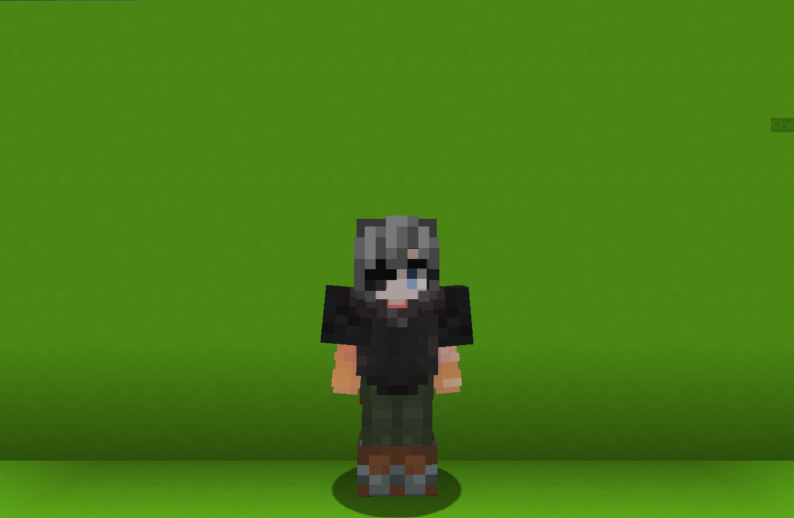

<table>
    <tr>
        <th>Bounty Hunter</th>
    </tr>
</table>

<table>
    <tr>
        <th>Description</th>
    </tr>
</table>

>She is a skilled bounty hunter.  <i>'Jackpot! Everyone here's got a bounty on their head.'</i>
  Archetype:<b> 👣 Mobility</b>

 
<table>
    <tr>
        <th>Attributes</th>
    </tr>
</table>
<table>
    <tr>
        <th>Health</th>
        <td>♥ 100</td>
    </tr>
        <th>Attack</th>
        <td>🗡 100</td>
    <tr>
        <th>Defence</th>
        <td>🛡 100</td>
    </tr>
    <tr>
        <th>Speed</th>
        <td>🌊 100%</td>
    </tr>
    <tr>
        <th>Crit Chance</th>
        <td>☢ 10%</td>
    </tr>
    <tr>
        <th>Crit Damage</th>
        <td>☠ 50%</td>
    </tr>
    <tr>
        <th>Attack Speed</th>
        <td>⚔ 100%</td>
    </tr>
</table>
 

<table>
    <tr>
        <th>Weapon</th>
    </tr>
</table>
<table>
    <tr>
        <td><b>Bloodweep</b></td>
        <td>A handy sword that appeared in her drean.</td>
    </tr>
</table>

<table>
    <tr>
        <th>Talents</th>
    </tr>
</table>

---
<table>
    <tr>
        <th>Shorty</th>
        <th></th>
    </tr>
    <tr>
        <td>
            Damage Talent
             Shoot you double barrel to deal <b>damage</b> that <i>falls</i> <i>off</i> with <b>distance</b>.
              If hit <b>enemy</b> is <b>close enough</b>, they will <b>Bleed</b> and will be <b>Vulnerable</b> for <b>5s</b>.
             <b>Additionaly, if used while on a Grapple Hook</b>, the damage is increased.
              <i>This ability can be shit twice consecutively before reloading.</i>
        </td>
      <td>
          Details
           Damage
           Deals damage to enemies.
            Cooldown: 2.5s
           Point Generation: 1
           Bleed Treshold: 1 block
           Bleed Duration: 5s
           Pellets: 12
           Max Damage Per Pellet: 7
           Spread: 0.5
           Max Distance: 3 blocks
      </td>
    </tr>
    <tr>
        <th>Grappling Hook</th>
        <th></th>
    </tr>
    <tr>
        <td>
            Movement Talent
             Launch a <b>grappling hook</b> that travels up to <b>30 blocks</b>.
              Whenever it hits a <b>block</b> or an <b>enemy</b>, it will pull <i>you</i> <i>towards</i> it.
             <i>The hook can be destroyed.</i>
              <i>The cooldown of this ability starts after all the charges are used.</i>
        </td>
        <td>
            Details
             Movement
             Provides a way to swiftly flee the battlefield or enter the battle. Or just to have fun.
             Point Generation: 1
              On Hook Multiplier: 1.5
             Cuts to Remove: 3
             Max Distance: 30 blocks
             Cooldown: 10s
             Max Charges: 3
        </td>
    </tr>
    <tr>
        <th>Smoke Bomb</th>
        <th></th>
    </tr>
    <tr>
        <td>
            Enhance Passive
             Whenever your <b>health</b> falls <u>below</u> <b>50%</b> you gain a <b>Smoke Bomb</b>.
              Throw it to create a <b>smoke field</b> that <b>blinds</b> everyone inside it and grant you a <b>speed boost</b>.
        </td>
        <td></td>
    </tr>
    <tr>
        <th>Backstab</th>
        <th></th>
    </tr>
    <tr>
        <td>
            Damage Ultimate
             Instantly <b>teleport</b> behind the <b>target</b> player, <b>stabbing</b> them from begind.
        </td>
        <td>
            Details
             Damage
             Deals damage to enemies
              Cooldown: 35s
             Duration: 1s
             Backstab Max Distance: 15
             Backstab Damage: 30
             Ultimate Cost: 70 ※
             Cast Duration: Instant
        </td>
    </tr>
</table>