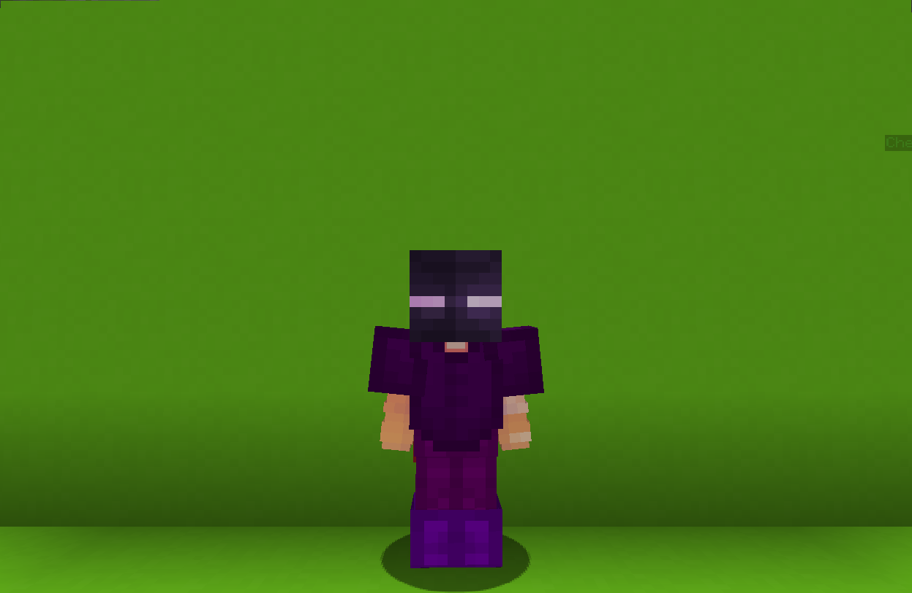

<table>
    <tr>
        <th>Ender</th>
    </tr>
</table>

<table>
    <tr>
        <th>Description</th>
    </tr>
</table>

>Weird enderman-like looking warrior with teleportation abilities. Hits you with his arm, but it hurts like a brick.
  Archetype:<b> 👣 Mobility</b>

 
<table>
    <tr>
        <th>Attributes</th>
    </tr>
</table>
<table>
    <tr>
        <th>Health</th>
        <td>♥ 120</td>
    </tr>
        <th>Attack</th>
        <td>🗡 100</td>
    <tr>
        <th>Defence</th>
        <td>🛡 100</td>
    </tr>
    <tr>
        <th>Speed</th>
        <td>🌊 100%</td>
    </tr>
    <tr>
        <th>Crit Chance</th>
        <td>☢ 10%</td>
    </tr>
    <tr>
        <th>Crit Damage</th>
        <td>☠ 50%</td>
    </tr>
    <tr>
        <th>Attack Speed</th>
        <td>⚔ 100%</td>
    </tr>
</table>
 

<table>
    <tr>
        <th>Weapon</th>
    </tr>
</table>
<table>
    <tr>
        <td><b>Fist</b></td>
        <td>
            Just a normal-sized fist.
              
        </td>
    </tr>
</table>

<table>
    <tr>
        <th>Talents</th>
    </tr>
</table>

---
<table>
    <tr>
        <th>Rideable Pearl</th>
        <th></th>
    </tr>
    <tr>
        <td>
            Movement Talent
              Throw an ender pearl and mount to ride it all the way!
             <b>SNEAK</b> to throw normally.
        </td>
      <td>
          Details
           Movement
           Provides a way to swiftly flee the battlefield or enter the battle. Or just to have fun.
            Cooldown: 8s
           Point Generation: 1
      </td>
    </tr>
    <tr>
        <th>Transmission Beacon</th>
        <th></th>
    </tr>
    <tr>
        <td>
            Damage Talent
             Placve the beacon somewhere hidden from your opponents.
             Use your ultimate to instantly teleport to its location and collect it.
              <b>The beacon can be destroyed!</b>
        </td>
        <td>
            Details
             Damage
             Deals damage to enemies.
              Point Regeneration: 1
             Cooldown if Destroyed: 30s
        </td>
    </tr>
    <tr>
        <th>Ender Skin</th>
        <th></th>
    </tr>
    <tr>
        <td>
            Enhance Passive
             With great power. comes great... strength!
             Your skin is too weak for the <b>water</b>. though on <b>teleport</b>:
              - Heal for <b>4 ♥</b>.
             - Deal <b>1</b> damage in small <b>AoE</b>.
             — Gain <b>20% 🗡Attack boost</b> for a short duration.
        </td>
        <td></td>
    </tr>
    <tr>
        <th>Transmission!</th>
        <th></th>
    </tr>
    <tr>
        <td>
            Movement Ultimate
             Instantly teleport to your <b>Transmission Beacon</b> and collect it for further use.
        </td>
        <td>
            Details
             Movement
             Provides a way to swiftly flee the battlefield or enter the battle. Or just to have fun.
              Cooldown: 20s
             Ultimate Cost: 50 ※
             Cast Duration: Instant
        </td>
    </tr>
</table>