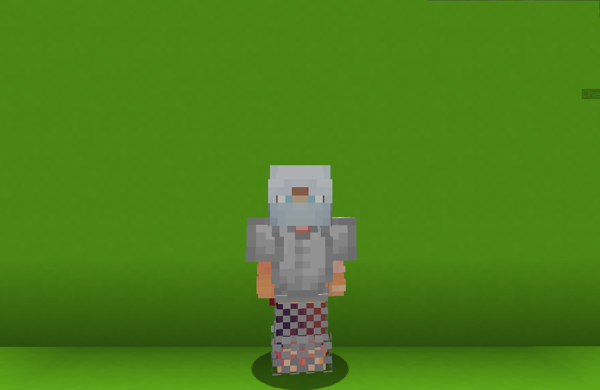

<table>
    <tr>
        <th>Ninja</th>
    </tr>
</table>

<table>
    <tr>
        <th>Description</th>
    </tr>
</table>

>An extremely well-trained fighter with a gift from the wind.
  Archetype:<b> 👣 Mobility</b>

 
<table>
    <tr>
        <th>Attributes</th>
    </tr>
</table>
<table>
    <tr>
        <th>Health</th>
        <td>♥ 100</td>
    </tr>
        <th>Attack</th>
        <td>🗡 100</td>
    <tr>
        <th>Defence</th>
        <td>🛡 100</td>
    </tr>
    <tr>
        <th>Speed</th>
        <td>🌊 115%</td>
    </tr>
    <tr>
        <th>Crit Chance</th>
        <td>☢ 10%</td>
    </tr>
    <tr>
        <th>Crit Damage</th>
        <td>☠ 50%</td>
    </tr>
    <tr>
        <th>Attack Speed</th>
        <td>⚔ 100%</td>
    </tr>
</table>
 

<table>
    <tr>
        <th>Weapon</th>
    </tr>
</table>
<table>
    <tr>
        <td><b>斬馬刀</b></td>
        <td>
            Light but sharp sword.
              <b>Ability: Stun ATTACK</b>
             Stunthe attackedenemy but lose 50% of weapon damage.
              Cooldown: 10s
        </td>
    </tr>
</table>

<table>
    <tr>
        <th>Talents</th>
    </tr>
</table>

---
<table>
    <tr>
        <th>Dashing Wind</th>
        <th></th>
    </tr>
    <tr>
        <td>
            Damage Talent
             Instantly propel yourself into the direction you're looking.
        </td>
      <td>
          Details
           Damage
           Deals damage to enemies
            Cooldown: 5s
           Point Generation: 1
           Magnitude: 1
      </td>
    </tr>
    <tr>
        <th>Smoke Bomb</th>
        <th></th>
    </tr>
    <tr>
        <td>
            Enhance Talent
             Throw a smoke bomb at your current locationand enter <b>💥 Shadowstrike</b> state.
              While in this state, become <b>invisible</b>.
              Inflicting <b>damage</b> will <u>clear</u> this state and trigger the following effects:
             - <b>Slows</b> the attacked enemy
             - Grants you <b>50% Dodge</b> for <b>6s</b>.
        </td>
        <td>
            Details
             Enhance
             Strengthen yourself for the battle.
              Cooldown: 20s
             Duration: 6s
             Point Generation: 2
             Dodge Increase: 50%
             Buff Duration: 6s
             Smoke Distance: 4 blocks
        </td>
    </tr>
    <tr>
        <th>Ninja Style</th>
        <th></th>
    </tr>
    <tr>
        <td>
            Enhance Passive
             Ninjas are fast and agile.
              You gain <b>🌊 Speed</b> boost, can <b>double jump</b> and don't take <b>fall</b> damage!
        </td>
        <td></td>
    </tr>
    <tr>
        <th>Throwing Stars</th>
        <th></th>
    </tr>
    <tr>
        <td>
            Damage Ultimate
             Equip <b>5</b> dead-accurate <b>throwing stars</b> that deal <b>20</b> damage upon hitting an enemy
        </td>
        <td>
            Details
             Damage
             Deals damage to enemies
             Ultimate Cost: 70 ※
             Cast Duration: Instant
        </td>
    </tr>
</table>