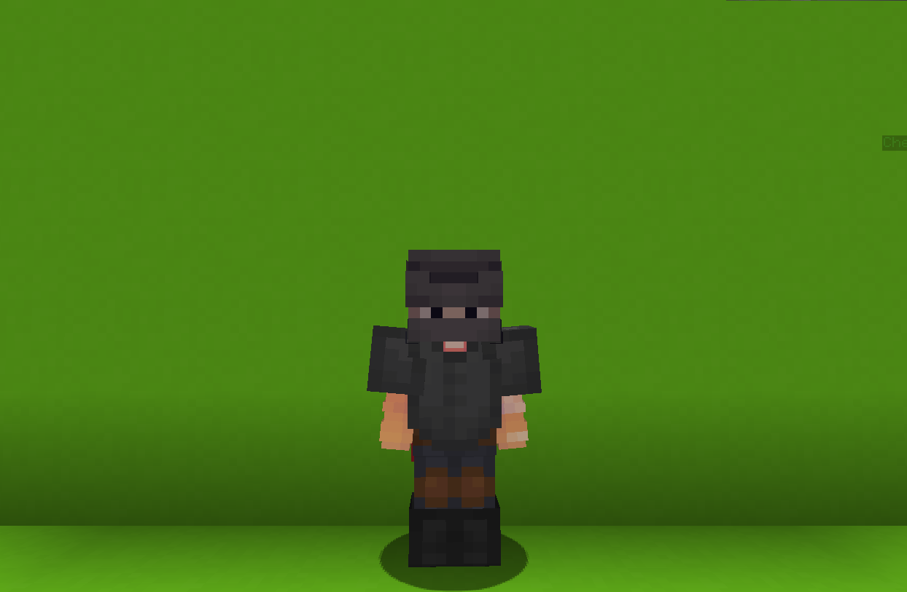

<table style="width: 100%">
    <tr>
        <th style="text-align: center;font-size: 40px">Archer</th>
    </tr>
</table>

<table style="width: 100%">
    <tr>
        <th style="text-align: center;font-size: 30px;padding-top:2%">Description</th>
    </tr>
</table>

>One of the best archers joins the fight!
 Not alonethoughbut with his <b>custom-made</b> bow.
  Archetype:<b> 🎯 Range</b>

 
<table style="width: 100%">
    <tr>
        <th style="text-align: center;font-size: 40px">Attributes</th>
    </tr>
</table>
<table style="width: 100%;">
  <tr>
    <th style="text-align: center;font-size: 25px">Health</th>
    <td style="text-align: center;color:red;font-size: 30px">♥ 100</td>
  </tr>
    <th style="text-align: center;font-size: 25px">Attack</th>
    <td style="text-align: center;color:darkred;font-size: 30px">🗡 100</td>
  <tr>
    <th style="text-align: center;font-size: 25px">Defence</th>
    <td style="text-align: center;color:green;font-size: 30px">🛡 80</td>
  </tr>
  <tr>
    <th style="text-align: center;font-size: 25px">Speed</th>
    <td style="text-align: center;color:red;font-size: 30px">
        🌊 115%
    </td>
  </tr>
  <tr>
    <th style="text-align: center;font-size: 25px">Crit Chance</th>
    <td style="text-align: center;color:red;font-size: 30px">
        ☢ 10%
    </td>
  </tr>
  <tr>
    <th style="text-align: center;font-size: 25px">Crit Damage</th>
    <td style="text-align: center;color:red;font-size: 30px">
        ☠ 50%
    </td>
  </tr>
  <tr>
    <th style="text-align: center;font-size: 25px">Attack Speed</th>
    <td style="text-align: center;color:red;font-size: 30px">
        ⚔ 100%
    </td>
  </tr>
</table>
 

<table style="width: 100%">
    <tr>
        <th style="text-align: center;font-size: 40px">Weapon</th>
    </tr>
</table>
<table style="width: 100%">
    <tr>
        <td style="text-align: center;font-size: 25px;color:green"><b>Weapon</b>
        </td>
        <td style="text-align: center;font-size: 25px;width:55%;color:white">
          A custom-made bow with some unique abilities!
        </td>
    </tr>
</table>

<table style="width: 100%">
    <tr>
        <th style="text-align: center;font-size: 40px">Talents</th>
    </tr>
</table>

---
<table style="width: 100%;">
  <tr>
    <th style="text-align: left;font-size: 30px;color:green">Triple Shot</th>
    <th></th>
  </tr>
  <tr>
    <td style="text-align: left;color:gray;font-size: 25px">
        Damage Talent
         
        
            Shoots three arrows in front of you.
             Two additional arrows deal 50% of onrmal damage.
        
    </td>
    <td style="text-align: left;color:gray;font-size: 25px;width:50%">
        Details
         
        
            Damage
             
                Deals daamge to enemies.
             
             Cooldown: 3.8s
             Spread: 5 degree
        
    </td>
  </tr>

  <tr>
    <th style="text-align: left;font-size: 30px;color:green">Shock Dart</th>
    <th></th>
  </tr>
  <tr>
    <td style="text-align: left;color:gray;font-size: 25px">
        Damage Talent
         
        
            Shoots an arrow infused with shicking power. Upon hit, Charges and explodes dealing damage based on distance.
        
    </td>
    <td style="text-align: left;color:gray;font-size: 25px;width:50%">
        Details
         
        
            Damage
             
                Deals daamge to enemies.
             
             Cooldown: 6s
             Explosion Radius: 3.7s
             Explosion Max Damage: 156
             Explosion Windup: 0.9s
        
    </td>
  </tr>

  <tr>
    <th style="text-align: left;font-size: 30px;color:green">Hawkeye Arrow</th>
    <th></th>
  </tr>
  <tr>
    <td style="text-align: left;color:gray;font-size: 25px">
        Damage Passive
         
        
            Fully charged shots while sneaking have <b>25%</b> chance to fire a hawkeye arrow that homes to nearby enemies.
        
    </td>
    <td></td>
  </tr>

  <tr>
    <th style="text-align: left;font-size: 30px;color:green">Boom Bow</th>
    <th></th>
  </tr>
  <tr>
    <td style="text-align: left;color:gray;font-size: 25px">
        Damage Ultimate
         
        
            Equip a <b>BOOM BOW</b> for <b>6s</b> that firres explosive arrows that explode on impact dealing with massive true damage.
        
    </td>
    <td style="text-align: left;color:gray;font-size: 25px;width:50%">
        Details
         
        
            Damage
             
                Deals damage to enemies
             
             Cooldown: 20s
             Duration: 5s
             Explosion Radius: 5.0 blocks
             Explosion Damage: 30.0
             Ultimate Cost: 60 ※
             Cast Duration: Instant
        
    </td>
  </tr>
</table>