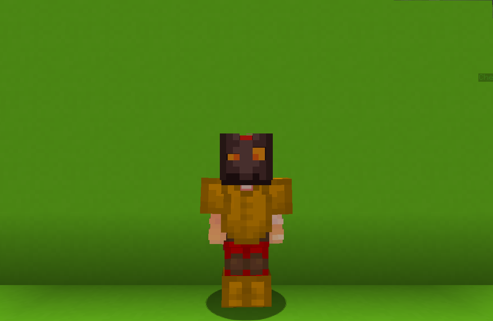

<table style="width: 100%">
    <tr>
        <th style="text-align: center;font-size: 40px">Spark</th>
    </tr>
</table>

<table style="width: 100%">
    <tr>
        <th style="text-align: center;font-size: 30px;padding-top:2%">Description</th>
    </tr>
</table>

>Strikes with fire! ...literally.
  Archetype:<b> 🎯 Range</b>

 
<table style="width: 100%">
    <tr>
        <th style="text-align: center;font-size: 40px">Attributes</th>
    </tr>
</table>
<table style="width: 100%;">
  <tr>
    <th style="text-align: center;font-size: 25px">Health</th>
    <td style="text-align: center;color:red;font-size: 30px">♥ 100</td>
  </tr>
    <th style="text-align: center;font-size: 25px">Attack</th>
    <td style="text-align: center;color:darkred;font-size: 30px">🗡 100</td>
  <tr>
    <th style="text-align: center;font-size: 25px">Defence</th>
    <td style="text-align: center;color:green;font-size: 30px">🛡 100</td>
  </tr>
  <tr>
    <th style="text-align: center;font-size: 25px">Speed</th>
    <td style="text-align: center;color:red;font-size: 30px">
        🌊 100%
    </td>
  </tr>
  <tr>
    <th style="text-align: center;font-size: 25px">Crit Chance</th>
    <td style="text-align: center;color:red;font-size: 30px">
        ☢ 10%
    </td>
  </tr>
  <tr>
    <th style="text-align: center;font-size: 25px">Crit Damage</th>
    <td style="text-align: center;color:red;font-size: 30px">
        ☠ 50%
    </td>
  </tr>
  <tr>
    <th style="text-align: center;font-size: 25px">Attack Speed</th>
    <td style="text-align: center;color:red;font-size: 30px">
        ⚔ 100%
    </td>
  </tr>
</table>
 

<table style="width: 100%">
    <tr>
        <th style="text-align: center;font-size: 40px">Weapon</th>
    </tr>
</table>
<table style="width: 100%">
    <tr>
        <td style="text-align: center;font-size: 25px;color:green"><b>Fire Sprayer</b>
        </td>
        <td style="text-align: center;font-size: 25px;width:55%;color:white">
          A long range weapon tha can shoot fire lasers in front of you! How cool is that...
            <b>Ability: Shoot! RIGHT CLICK</b>
           Shoot your weapon.
            <b>Ability: Reload! LEFT CLICK</b>
           Reload your weapon manually.
            <b>ATTRIBUTES:</b>
           FIRE RATE: 1.5s
           MAX DISTANCE:40.0
           DAMAGE: 8.0
           MAX AMMO: 8
           RELOAD TIME: 4.5s
        </td>
    </tr>
</table>

<table style="width: 100%">
    <tr>
        <th style="text-align: center;font-size: 40px">Talents</th>
    </tr>
</table>

---
<table style="width: 100%;">
  <tr>
    <th style="text-align: left;font-size: 30px;color:green">Hot Hands</th>
    <th></th>
  </tr>
  <tr>
    <td style="text-align: left;color:gray;font-size: 25px">
        Damage Talent
         
        
            Throw a fireball in front of you that flies for maximum of <b>3s</b>.
              Upon landing, set the ground on <b>fire</b>, <b>damaging</b> enemies and <b>healing</b> yourself.
        
    </td>
    <td style="text-align: left;color:gray;font-size: 25px;width:50%">
        Details
         
        
            Damage
             
                Deals damage to enemies
             
             Cooldown: 35s
             Point Generation: 3
             Maximum Air Time: 3s
             Fire Radius: 3 blocks
             Fire Duration: 5s
             Fire Damage: 3
             Fire Healing: 1 ♥/Interval
             Fire Interval: 0.2s
        
    </td>
  </tr>

  <tr>
    <th style="text-align: left;font-size: 30px;color:green">Blinding Curve</th>
    <th></th>
  </tr>
  <tr>
    <td style="text-align: left;color:gray;font-size: 25px">
        Impair Talent
         
        
            Throw an energy blast filled withblinding energy that curves up and explodes after a short delay, blinding anyone looking at it.
              Enemies also receive small fire damage.
        
    </td>
    <td style="text-align: left;color:gray;font-size: 25px;width:50%">
        Details
         
        
            Impair
             
                Weaken enemies by debuffing them.
             
             Cooldown: 15s
             Point Generation: 1
             Flash Duration: 3s
             Max Distance: 50
             Windup Time: 0.8s
             Fire Damage: 2
        
    </td>
  </tr>

  <tr>
    <th style="text-align: left;font-size: 30px;color:green">Fire Guy</th>
    <th></th>
  </tr>
  <tr>
    <td style="text-align: left;color:gray;font-size: 25px">
        Enhance Passive
         
        
            You're completely immune to <b>lava</b> and <b>fire</b> damage.
        
    </td>
    <td></td>
  </tr>

  <tr>
    <th style="text-align: left;font-size: 30px;color:green">Run it Back</th>
    <th></th>
  </tr>
  <tr>
    <td style="text-align: left;color:gray;font-size: 25px">
        Enhance Ultimate
         
        
            Instantly place a marker at youe current location for 6s.
              Upon death or after duration ends, safely teleport to the markerd location with health you had upon activating the ability.
        
    </td>
    <td style="text-align: left;color:gray;font-size: 25px;width:50%">
        Details
         
        
            Enhance
             
                Strenthen yourself for the battle.
             
             Cooldown: 40s
             Duration: 6s
             Ultimate Cost: 80 ※
             Cast Duration: Instant
        
    </td>
  </tr>
</table>