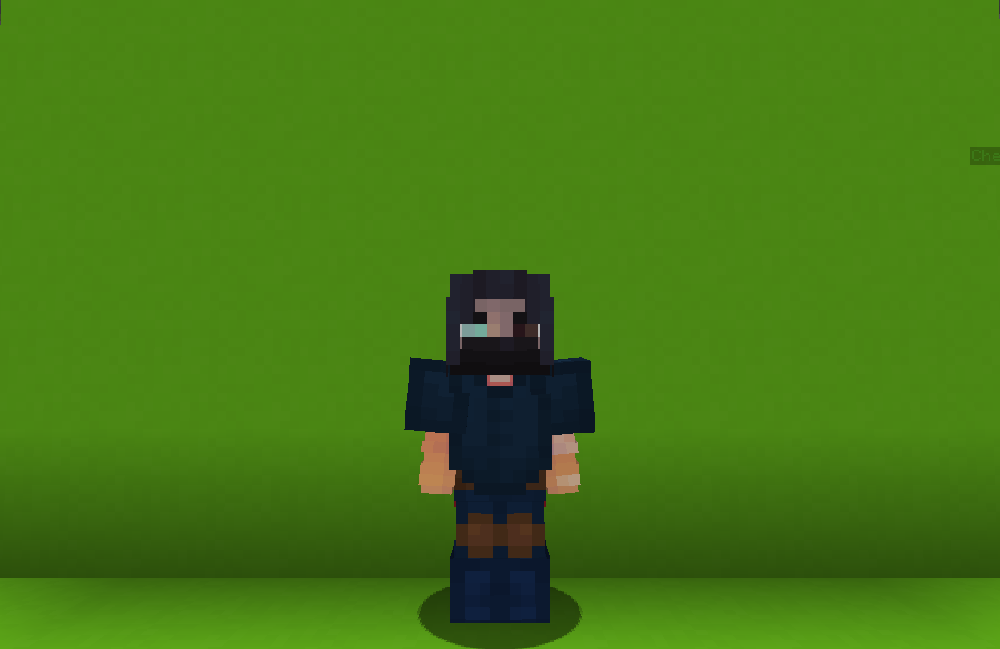

<table>
    <tr>
        <th>Swooper</th>
    </tr>
</table>

<table>
    <tr>
        <th>Description</th>
    </tr>
</table>

>A mercenary sniper with a slow firing rifle.
  Archetype:<b> 🎯 Range</b>

 
<table>
    <tr>
        <th>Attributes</th>
    </tr>
</table>
<table>
  <tr>
    <th>Health</th>
    <td>♥ 100</td>
  </tr>
    <th>Attack</th>
    <td>🗡 100</td>
  <tr>
    <th>Defence</th>
    <td>🛡 100</td>
  </tr>
  <tr>
    <th>Speed</th>
    <td>🌊 115%</td>
  </tr>
  <tr>
    <th>Crit Chance</th>
    <td>☢ 10%</td>
  </tr>
  <tr>
    <th>Crit Damage</th>
    <td>☠ 50%</td>
  </tr>
  <tr>
    <th>Attack Speed</th>
    <td>⚔ 100%</td>
  </tr>
</table>
 

<table>
    <tr>
        <th>Weapon</th>
    </tr>
</table>
<table>
    <tr>
        <td><b>Sniper Rifle</b></td>
        <td>
            Slow firing sniper rifle.
             <i>Looks like a gift from someone important.</i>
             <b>Ability: Scope SNEAK</b>
             Activates a sniper score, increase the max bullet distance.
              <b>Ability: Shoot RIGHT CLICK</b>
             Shoot your weapon.
              <b>Ability: Stun ATTACK</b>
             Hitting an <b>enemy</b> with your rifle has a small chance to <b>stun</b> them.
              ATTRIBUTES:
             FIRE RATE: 2s
             MAX DISTANCE: 75.0
             DAMAGE: 8.0
             MAX AMMO: 5
             RELOAD TIME: 6s
        </td>
    </tr>
</table>

<table>
    <tr>
        <th>Talents</th>
    </tr>
</table>

---
<table>
  <tr>
    <th>Blast Pack</th>
    <th></th>
  </tr>
  <tr>
    <td>
        Movement Charged Talent
         Throw and explosive <b>C4</b> in front of you that <u>sticks</u> to surfaces.
          <u>Use</u> again to <b>explode</b>, damaging <b>enemies</b> and moving all <b>entities</b>.
         <i>If an enemy is close to explosion, they will be stunned.</i>
    </td>
    <td>
        Details
         Movement
         Provides a way to swiftly flee the battlefield or enter the battle. Or just to have fun.
          Cooldown between charges: 0.1s
         Point Generation: 1
         Max Air Time: 15s
         Max Life Time: 5s
         Explosion Radius: 4 blocks
         Stun Distance: 2
         Stun Duration: 2s
         Self Magnitude: 1.5
         Other Magnitude: 0.5
         Damage: 2
         Max Charges: 2
         Recharge Time: 8s
    </td>
  </tr>

  <tr>
    <th>Smoke Bomb</th>
    <th></th>
  </tr>
  <tr>
    <td>
        Support Talent
         Throw a smoke bomb in front of you.
          Upon <i>landing</i> create a <b>smoke field</b> that <b>blinds</b> and <b>highlights enemies</b>.
          <i>Also gain a small speed increase.</i>
    </td>
    <td>
        Details
         Support
         Provide buffs to teammates.
          Cooldown: 20s
         Duration: 5s
         Point Generation: 2
         Radius: 3
         Speed Increase: 0.0
    </td>
  </tr>

  <tr>
    <th>Sniper Nest</th>
    <th></th>
  </tr>
  <tr>
    <td>
        Enhance Passive
         While <u>scoping</u> for a <b>5s</b>, create <b>Sniper Nest</b> and enter <b>🎪 Refraction</b>.
          <b>🎪 Refraction</b>:
         Become <b>invisible</b> and <b>increase</b> your rifle damage.
          <i>Taking damage, moving or un-scoping clears this effect.</i>
    </td>
    <td></td>
  </tr>

  <tr>
    <th>Echolocation</th>
    <th></th>
  </tr>
  <tr>
    <td>
        Enhance Ultimate
         Instantly cast a <b>wave</b> outwards that <b>scans</b> for enemies.
          After a short delay, <b>highlight</b> all hit <b>enemies</b>.
          Also, gain <b>🧨 Overcharge</b> shotas, that have <b>increased damage</b> and can <u>shoot through</u> walls.
          Ultimate is considering as active until all Overcharge shots are fired
    </td>
    <td>
        Details
         Enhance
         Strengthen yourseld for the battle.
          Ultimate Radius: 100
         Ultimate Damage Multiplier: 2.5s
         Ultimate Cost: 60 ※
         Cast Duration: 1s
    </td>
  </tr>
</table>