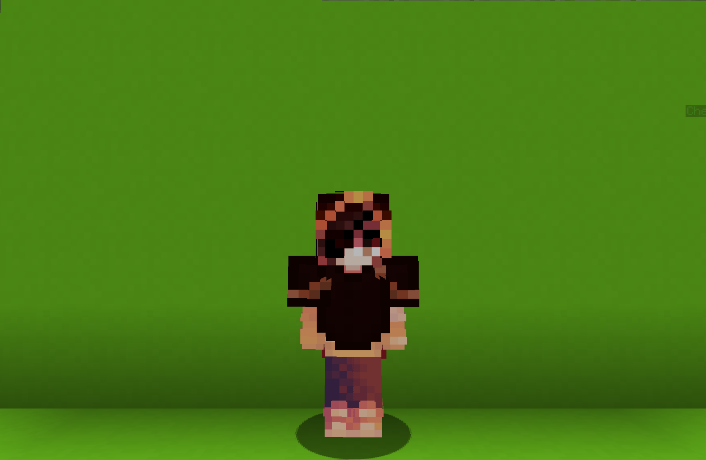

<table>
    <tr>
        <th>Alchemist</th>
    </tr>
</table>

<table>
    <tr>
        <th>Description</th>
    </tr>
</table>

>An alchemist who was deceived by the creation of the abyss.
  Archetype:<b> 💡 Strategy</b>

 
<table>
    <tr>
        <th>Attributes</th>
    </tr>
</table>
<table>
    <tr>
        <th>Health</th>
        <td>♥ 125</td>
    </tr>
        <th>Attack</th>
        <td>🗡 100</td>
    <tr>
        <th>Defence</th>
        <td>🛡 50</td>
    </tr>
    <tr>
        <th>Speed</th>
        <td>🌊 110%</td>
    </tr>
    <tr>
        <th>Crit Chance</th>
        <td>☢ 10%</td>
    </tr>
    <tr>
        <th>Crit Damage</th>
        <td>☠ 50%</td>
    </tr>
    <tr>
        <th>Attack Speed</th>
        <td>⚔ 100%</td>
    </tr>
</table>
 

<table>
    <tr>
        <th>Weapon</th>
    </tr>
</table>
<table>
    <tr>
        <td><b>Stick</b></td>
        <td>Turns out that a stick used in breating can also be used in battle.</td>
    </tr>
</table>

<table>
    <tr>
        <th>Talents</th>
    </tr>
</table>

---
<table>
    <tr>
        <th>Abyssal Bottle</th>
        <th></th>
    </tr>
    <tr>
        <td>
            Enhance Talent
             A bottle that is capable of creating potions from the <b>Abyss</b> itself.
             Drink to gain random positive effect.
        </td>
      <td>
          Details
           Enhance
           Strengthen yourself for the battle.
            Cooldown: 2.5s
           Point Generation: 1
           Toxin Accumulation: 12
           Effect Duration: 3s
      </td>
    </tr>
    <tr>
        <th>Brewing Pot</th>
        <th></th>
    </tr>
    <tr>
        <td>
            Creatable Talent
             Place a Brewing Cauldron to brew a Magic Potion. Put your Brewing Stick in it and wait!
              Once ready. claim you potion and enhance
            yourself with the following effects:
              — Drinking a potion will grant double
            effects. <b>(5 charges)</b>
              — Hitting an enemy will apply random
            effect. <b>(10 charges)</b>
        </td>
        <td>
            Details
             Creatable
             This ability appears in the world as a physical entity.
              Cooldown: 120s
             Point Generation: 12
        </td>
    </tr>
    <tr>
        <th>Intoxication</th>
        <th></th>
    </tr>
    <tr>
        <td>
            Enhance Passive
             Drinking potions will increase <b>Intoxication</b> level that will decrease constantly.
              Having high <b>Intoxication</b> levels isn't good for your body!
        </td>
        <td></td>
    </tr>
    <tr>
        <th>Alchemical Madness</th>
        <th></th>
    </tr>
    <tr>
        <td>
            Enhance Ultimate
             Call upon the darkest spells to cast random <b>Negative</b> effect on your foes for <b>15s</b> and random <b>Positive</b> effect in yourself for <b>30s</b>.
        </td>
        <td>
            Details
             Enhance
             Strengthen yourseld for the battle.
              Cooldown: 30s
             Ultimate Cost: 50 ※
             Cast Duration: Instant
        </td>
    </tr>
</table>