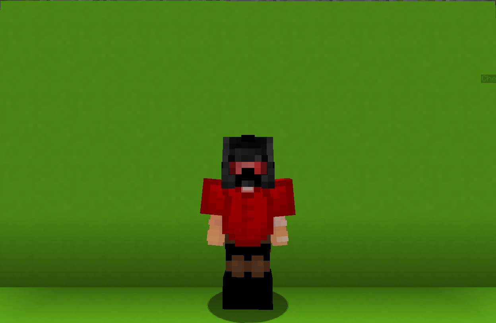

<table>
    <tr>
        <th>Engineer</th>
    </tr>
</table>

<table>
    <tr>
        <th>Description</th>
    </tr>
</table>

>A Genius with 12 PHDs. He made all of his building himself. Though, he uses just two of those.
 And your best hope - Not pointed at you.
  Archetype:<b> 💢 Archetype</b>

 
<table>
    <tr>
        <th>Attributes</th>
    </tr>
</table>
<table>
    <tr>
        <th>Health</th>
        <td>♥ 100</td>
    </tr>
        <th>Attack</th>
        <td>🗡 100</td>
    <tr>
        <th>Defence</th>
        <td>🛡 100</td>
    </tr>
    <tr>
        <th>Speed</th>
        <td>🌊 100%</td>
    </tr>
    <tr>
        <th>Crit Chance</th>
        <td>☢ 10%</td>
    </tr>
    <tr>
        <th>Crit Damage</th>
        <td>☠ 50%</td>
    </tr>
    <tr>
        <th>Attack Speed</th>
        <td>⚔ 100%</td>
    </tr>
</table>
 

<table>
    <tr>
        <th>Weapon</th>
    </tr>
</table>
<table>
    <tr>
        <td><b>Prototype Wrench</b></td>
        <td>
            A Prototype Wrench for all the needs.
             It... Probably hurts to be hit with it.
        </td>
    </tr>
</table>

<table>
    <tr>
        <th>Talents</th>
    </tr>
</table>

---
<table>
    <tr>
        <th>Spotter</th>
        <th></th>
    </tr>
    <tr>
        <td>
            Creatable Talent
             Create a <b>Spotter</b> that will <b>mark</b> all nearby <b>enemies</b>.
        </td>
      <td>
          Details
           Creatable
           This ability appears in the world as a physical entity.
            Cooldown: 15s
           Duration: 10s
           Point Generation: 1
      </td>
    </tr>
    <tr>
        <th>Sentry</th>
        <th></th>
    </tr>
    <tr>
        <td>
            Creatable Talent
             Create a <b>Sentry</b> that will shoot the <b>nearest enemy</b>.
        </td>
        <td>
            Details
             Creatable
             This ability appears in the world as a physical entity.
              Cooldown: 35s
             Point Generation: 3
             Damage: 5
             Radius: 16
             Delay Between Shots: 1s
        </td>
    </tr>
    <tr>
        <th>Recall</th>
        <th></th>
    </tr>
    <tr>
        <td>
            Enhance Talent
             Destroy the current construct and regain 25% of its original cost.
        </td>
        <td>
            Details
             Enhance
             Strengthen yourself for the battle.
              Cooldown: 30s
             Point Generation: 3
        </td>
    </tr>
    <tr>
        <th>Magnetic Attraction</th>
        <th></th>
    </tr>
    <tr>
        <td>
            Enhance Passive
             Every few seconds you'll receive an Iron Ingot.
             use it to build stuff!
        </td>
        <td></td>
    </tr>
    <tr>
        <th>Mecha-Industries</th>
        <th></th>
    </tr>
    <tr>
        <td>
            Daamge Ultimate
             Instantly create a <b>mech suit</b> nad pilot it for <b>25s</b>.
              The suit provides <b>attack</b> power.
             <i>Looks like a wire sticking out of it, probably should keep away from water.</i>
        </td>
        <td>
            Details
             Damage
             Deals damage to enemies
              Cooldown: 35s
             Duration: 25s
             Ultimate In Water Damage: 10
             Ultimate Hit Cd: 0.2s
             Ultimate Cost: 70 ※  
             Cast Duration: Instant
        </td>
    </tr>
</table>