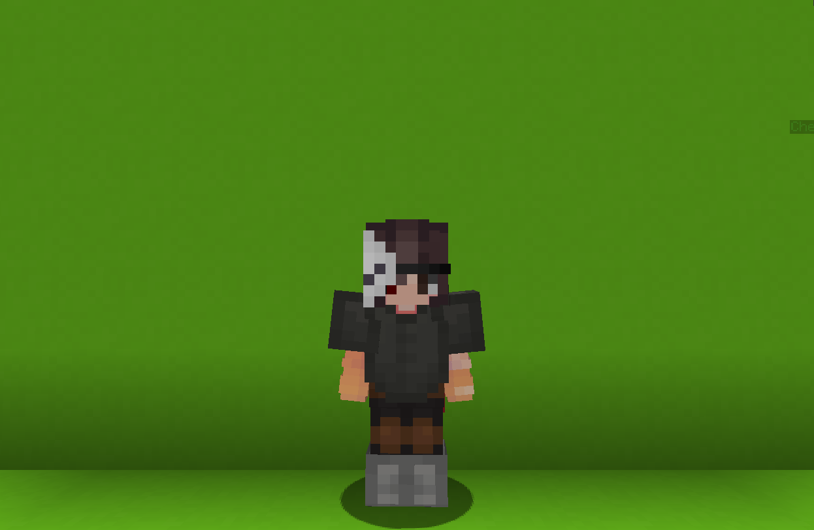

<table>
    <tr>
        <th>Harbinger</th>
    </tr>
</table>

<table>
    <tr>
        <th>Description</th>
    </tr>
</table>

>She is a harbinger of unknown organization.
 Nothing else is known.
  Archetype:<b> 💡 Strategy</b>

 
<table>
    <tr>
        <th>Attributes</th>
    </tr>
</table>
<table>
    <tr>
        <th>Health</th>
        <td>♥ 100</td>
    </tr>
        <th>Attack</th>
        <td>🗡 100</td>
    <tr>
        <th>Defence</th>
        <td>🛡 100</td>
    </tr>
    <tr>
        <th>Speed</th>
        <td>🌊 100%</td>
    </tr>
    <tr>
        <th>Crit Chance</th>
        <td>☢ 10%</td>
    </tr>
    <tr>
        <th>Crit Damage</th>
        <td>☠ 50%</td>
    </tr>
    <tr>
        <th>Attack Speed</th>
        <td>⚔ 100%</td>
    </tr>
</table>
 

<table>
    <tr>
        <th>Weapon</th>
    </tr>
</table>
<table>
    <tr>
        <td><b>Bow</b></td>
        <td>
            Just a normal bow.
              <b>ATTRIBUTES</b>:
            FIRE RATE: 0.8s
        </td>
    </tr>
</table>

<table>
    <tr>
        <th>Talents</th>
    </tr>
</table>

---
<table>
    <tr>
        <th>Melee Stance</th>
        <th></th>
    </tr>
    <tr>
        <td>
            Enhacne Talent
             Enter <b>⚔ Melee Stance</b> for maximum of <b>30s</b> to replace your bow with <b>Raging Blade!</b>
             <i>Also gain a Crit Chance increase while in this stance.</i>
              Use again in <b>⚔ Melee Stance</b> to get your bow back.
              <i>The longer you're in Melee Stance, the longer the cooldown of this ability.</i>
        </td>
      <td>
          Details
           Enhance
           Strengthen yourself for the battle.
            Cooldown: Dynamic
           Point Generation: 1
           Max Duration: 30s
           Minimim Cd: 1.5s
           Cd Per Second: 1.5s
           Crit Chance Increase: 30%
      </td>
    </tr>
    <tr>
        <th>Tidal Vortex</th>
        <th></th>
    </tr>
    <tr>
        <td>
            Impair Talent
             Launch a <b>giant vortex</b> in front.
              The vortex cinstantly <b>rushes</b> forward, applying <b>Riptide</b> and <b>pushing</b> enemies along with it.
        </td>
        <td>
            Details
             Impair
             Weaken enemies by debuffing them.
              Cooldown: 12s
             Duration: 3s
             Point Generation: 1
             Speed: 0.8
             Vertical Spread: 3
             Horizontal Spread: 5
             Inner To Outer Spread: 1.5
             Distance: 3
             Riptide Duration: 12s
        </td>
    </tr>
    <tr>
        <th>Riptide</th>
        <th></th>
    </tr>
    <tr>
        <td>
            Enhance Talent
             <u>Fully</u> <u>charged</u> shots in <b>🏹 Range Stance</b> or <b>critical</b> hits in <b>⚔ Melee Stance</b> apply the <b>Riptide</b> effect to enemies.
              Hitting opponents affecred by <b>Riptide</b> in the aforementioned ways will trigger <b>Riptide Slash</b>, which rapidly deals damage.
        </td>
        <td></td>
    </tr>
    <tr>
        <th>Crowned Mastery</th>
        <th></th>
    </tr>
    <tr>
        <td>
            Damage Ultimate
             Gather the surrounding energy to execute a <b>fatal strike</b> based in your <u>current</u> <u>stance</u>.
              <b>In Range Stance</b>
             Shoots a magic arrow in front of you that explodes upon impact, dealing moderate <b>AoE damage</b> and applying <b>Riptide</b>.
              <b>In Melle Stance</b>
             Performs a slash around you that deals significant <b>AoE damage</b>.
              If an enemy is affecred by <b>Riptide</b>, the damage is <b>increased</b> and the <b>Riptide</b> is removed.
        </td>
        <td>
            Details
             Damage
             Deals damage to enemies
              Duration: 2s
             Melee Riptide Amount: 100
             Range Riptide Amount: 150
             Ultimate Melee Damage: 40 
             Ultimate Melee Radius: 4
             Ultimate Melee Riptide Damage Multiplier: 1.5
             Ultimate Range Damage: 25
             Ultimate Range Riptide: 20s
             Ultimate Range Radius: 4
             Ultimate Cost: 70 ※
             Cast Duration: Instant
        </td>
    </tr>
</table>