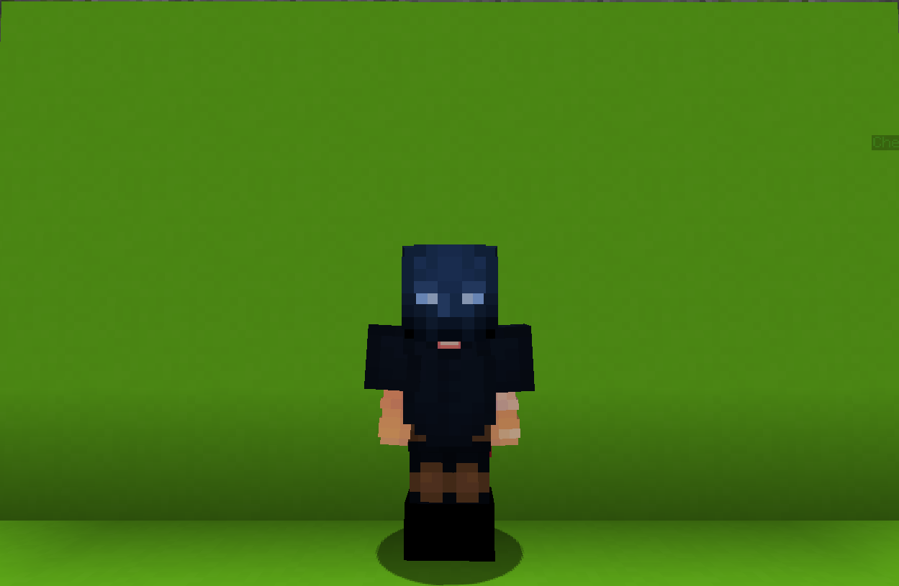

<table>
    <tr>
        <th>Shadow Assassin</th>
    </tr>
</table>

<table>
    <tr>
        <th>Description</th>
    </tr>
</table>

>An assassin with anger management issus from dimension of shadows. Capable of switching between being Stealth and Furious.
  Archetype:<b> 💡 Strategy</b>

 
<table>
    <tr>
        <th>Attributes</th>
    </tr>
</table>
<table>
    <tr>
        <th>Health</th>
        <td>♥ 100</td>
    </tr>
        <th>Attack</th>
        <td>🗡 100</td>
    <tr>
        <th>Defence</th>
        <td>🛡 100</td>
    </tr>
    <tr>
        <th>Speed</th>
        <td>🌊 100%</td>
    </tr>
    <tr>
        <th>Crit Chance</th>
        <td>☢ 10%</td>
    </tr>
    <tr>
        <th>Crit Damage</th>
        <td>☠ 50%</td>
    </tr>
    <tr>
        <th>Attack Speed</th>
        <td>⚔ 100%</td>
    </tr>
</table>
 

<table>
    <tr>
        <th>Weapon</th>
    </tr>
</table>
<table>
    <tr>
        <td><b>Livid Dagger</b></td>
        <td>
            A dagger made of bad memories.
              <b>Ability: Shadow Stab BACK STAB</b>
             Hit an enemy from behind to perform a shafow stab attack, reducing their <b>🛡 Defence</b> and stunning them for a short time.
              Cooldown: 20s
        </td>
    </tr>
</table>

<table>
    <tr>
        <th>Talents</th>
    </tr>
</table>

---
<table>
    <tr>
        <th>Shadow Switch</th>
        <th></th>
    </tr>
    <tr>
        <td>
            Enhance Talent
             <b>While in 5tealth mode</b>:
             Deal small <b>AoE damage</b> and switch to <b>Fury</b> mode.
              <b>• Cooldown: 2s</b>
              <b>While in Fury mode:</b>
             Deal small <b>AoE damage</b> and switch to <b>Stealth</b> mode.
              <b>• Cooldown: 2s
             • Energy Cost: 1</b>
        </td>
      <td>
          Details
           Enhance
           Strengthen yourself for the battle.
            Point Generation: 1
      </td>
    </tr>
    <tr>
        <th>Dark Cover</th>
        <th></th>
    </tr>
    <tr>
        <td>
            Damage Talent
             <b>While in 5tealth mode:</b>
             Cloak yourself in darkness and become <b>invisible</b> and <b>invulnerable</b> for a maximum of <b>6s</b>.
              Dealing damage clears this effect and deals <b>AoE damage</b>.
              Also regenerate <b>10 Shadow Energy</b> per enemy hit.
              <b>Cooldown: 12s</b>
              <b>While in Fury mode:</b>
             Instantly deal <b>AoE damage</b> in front of you and gain <b>🗡 Attack</b> boost.
              The damage dealt is <b>x2</b> of that in <b>Stealth</b> mode.
              <b>Cooldown: 18s
             Energy Cost: 25</b>
        </td>
        <td>
            Details
             Damage
             Deals damage to enemies.
              Point Generation: 1
             Dark Cover Duration: 6s
             Energy Regen: 10
             Explosion Radius: 3.5
             Explosion Damage: 10
             Attack Increase: 25%
             Attack Increase Duration: 3s
             Fury Damage Multiplier: 2
        </td>
    </tr>
    <tr>
        <th>Shadow Clone</th>
        <th></th>
    </tr>
    <tr>
        <td>
            Impair Talent
             <b>While in 5tealth mode:</b>
             Summon a <b>Shadow Clone</b> at your current location.
              The clone waits patiently for an <b>enemy</b> to come close before <b>attacking</b>, reducing their <b>🛡 Defense</b> and <b>disappearing</b>.
              Before the clone disappears, you can
            <b>teleport</b> to it, <u>regenerating</u> <b>25 Shadow Energy</b>.
              <i>Up to 3 clones can exist at the same time.</i>
              <b>Cooldown: 16s
              While in Fury mode:</b>
             Summon three <b>Shadow Clones</b> behind nearby <b>enemies</b>.
              Each clone instantly attacks the enemy, dealing <b>damage</b> and reducing <b>🛡 Defense</b>.
              <i>A single clone can target at most one enemy.
             Any existing clones will disappear.</i>
              <b>Cooldown: 20s
             Energy Cost: 50</b>
        </td>
        <td>
            Details
             Impair
             Weaken enemies by debuffing them.
              Point Generation: 1
             Clone Damage: 10
             Defence Reduction: 0,4
             Defence Reduction Duration: 6s
             Clone Limit: 3
             Energy Regen: 25
             Fury Clone Limit: 3
             Fury Clone Damage: 25
             Fury Clone Radius: 10
        </td>
    </tr>
    <tr>
        <th>Shadow Energy</th>
        <th></th>
    </tr>
    <tr>
        <td>
            Enhance Passive
             Accumulate <b>Shadow Energy</b> while using abilities in <b>Stealth</b> mode.
              Spend <b>Shadow Energy</b> to use empowered abilities in <b>Fury</b> mode.
        </td>
        <td></td>
    </tr>
    <tr>
        <th>Extreme Focus</th>
        <th></th>
    </tr>
    <tr>
        <td>
            Enhance Ultimate
             Enter <b>Extreme Focus</b> for <b>10s</b>.
              While active, your <b>melee</b> attacks will <u>not</u> miss if an enemy is close and has no cover.
              You cannot perform <b>Shadow Stab</b> while <b>Extreme Focus</b> is active.
        </td>
        <td>
            Details
             Enhance
             Strenthen yourself for the battle.
              Cooldown: 40s
             Duration: 10s
             Cooldown per hit: 20
             Ultimate Cost: 80 ※
             Cast Duration: Instant
        </td>
    </tr>
</table>