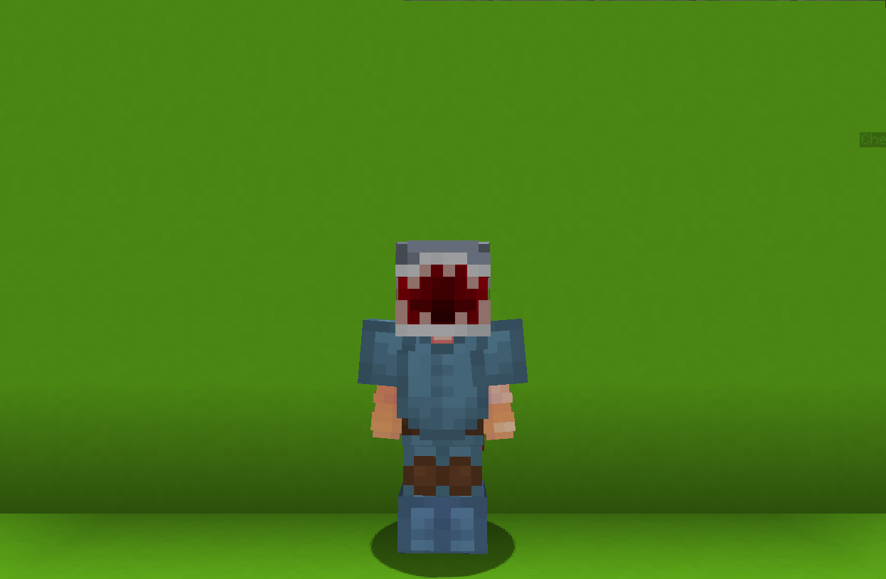

<table>
    <tr>
        <th>Shark</th>
    </tr>
</table>

<table>
    <tr>
        <th>Description</th>
    </tr>
</table>

>Strong warrior from the Depth of Waters... not well versed in on-land fights but don't let it touch the water, or you'll regret it.
  Archetype:<b> 💡 Strategy</b>

 
<table>
    <tr>
        <th>Attributes</th>
    </tr>
</table>
<table>
    <tr>
        <th>Health</th>
        <td>♥ 100</td>
    </tr>
        <th>Attack</th>
        <td>🗡 100</td>
    <tr>
        <th>Defence</th>
        <td>🛡 100</td>
    </tr>
    <tr>
        <th>Speed</th>
        <td>🌊 100%</td>
    </tr>
    <tr>
        <th>Crit Chance</th>
        <td>☢ 10%</td>
    </tr>
    <tr>
        <th>Crit Damage</th>
        <td>☠ 50%</td>
    </tr>
    <tr>
        <th>Attack Speed</th>
        <td>⚔ 100%</td>
    </tr>
</table>
 

<table>
    <tr>
        <th>Weapon</th>
    </tr>
</table>
<table>
    <tr>
        <td><b>Claws</b></td>
        <td>Using one's claws is a better idea that using stick, don't you think so?</td>
    </tr>
</table>

<table>
    <tr>
        <th>Talents</th>
    </tr>
</table>

---
<table>
    <tr>
        <th>Submerge</th>
        <th></th>
    </tr>
    <tr>
        <td>
            Damage Talent
             Swiftly subnerge underground and dash forward revealing a hidden shark fin that deals damage and knocks bacl nearby enemies.
        </td>
      <td>
          Details
           Damage
           Deals damage to enemies.
            Cooldown: 5s
           Duration: 1s
           Point Generation: 1
           Damage: 10
      </td>
    </tr>
    <tr>
        <th>Whirlpool</th>
        <th></th>
    </tr>
    <tr>
        <td>
            Damage Talent
             Create a whirlpool at your current location that pulls nearby enemies towards the center.
        </td>
        <td>
            Details
             Damage
             Deals damage to enemies.
              Cooldown: 16s
             Duration: 4s
             Point Generation: 1
        </td>
    </tr>
    <tr>
        <th>Oceanborn/Sturdy Claws</th>
        <th></th>
    </tr>
    <tr>
        <td>
            Enhance Passive
             <b>Oceanborn</b>:
             While in waterm your speed and damage is drastically increased.
              <b>Sturdy Claws</b>:
             Critical hits summons an ancient creatire from beneath that deals extra damage and heals you!
        </td>
        <td></td>
    </tr>
    <tr>
        <th>Ocean Madness</th>
        <th></th>
    </tr>
    <tr>
        <td>
            Damage Ultimate
             Creates a <b>Shark Aura</b> that follow you for <b>6s</b> and imitates water.
        </td>
        <td>
            Details
             Damage
             Deals damage to enemies
              Cooldown: 60s
             Duration: 6s
             Ultimate Cost: 70 ※
             Cast Duration: Instant
        </td>
    </tr>
</table>