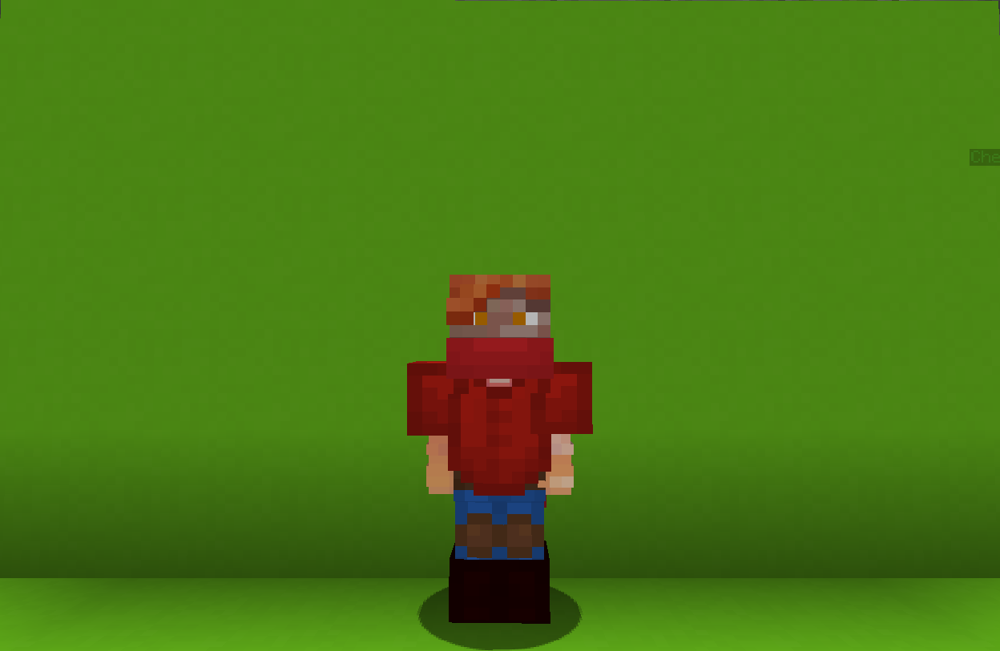

<table>
    <tr>
        <th>Tamer</th>
    </tr>
</table>

<table>
    <tr>
        <th>Description</th>
    </tr>
</table>

>A former circus pet trainer whi gained the ability to tame the elements.
  Archetype:<b> 💡 Strategy</b>

 
<table>
    <tr>
        <th>Attributes</th>
    </tr>
</table>
<table>
    <tr>
        <th>Health</th>
        <td>♥ 100</td>
    </tr>
        <th>Attack</th>
        <td>🗡 100</td>
    <tr>
        <th>Defence</th>
        <td>🛡 100</td>
    </tr>
    <tr>
        <th>Speed</th>
        <td>🌊 70%</td>
    </tr>
    <tr>
        <th>Crit Chance</th>
        <td>☢ 10%</td>
    </tr>
    <tr>
        <th>Crit Damage</th>
        <td>☠ 50%</td>
    </tr>
    <tr>
        <th>Attack Speed</th>
        <td>⚔ 100%</td>
    </tr>
</table>
 

<table>
    <tr>
        <th>Weapon</th>
    </tr>
</table>
<table>
    <tr>
        <td><b>Lash</b></td>
        <td>An old lash used to train beasts and monsters.</td>
    </tr>
</table>

<table>
    <tr>
        <th>Talents</th>
    </tr>
</table>

---
<table>
    <tr>
        <th>Mine 'o Ball</th>
        <th></th>
    </tr>
    <tr>
        <td>
            Summon Talent
             Summon a random pac of creatures that will aid you in battle.
              <b>Creatures:
             Dr. Witch
             Support 30 ♥ 🕒30s</b>
             Periodically splashes a <b>healing</b> potion on a <b>teammate</b> with the lowest health.
              <b>The wolf Pack
             Enhance 25 ♥ 🕒25s</b>
             <u>Each</u> <b>alive</b> wolf grants you an <b>🗡 Attack</b> boosts.
              <b>Pigman Rusher
             Damage 50 ♥ 🕒60s</b>
             <b>Rushes</b> and <b>attacks</b> all nearby enemies.
              <b>Laser Zombie
             Impair 20 ♥ 🕒20s</b>
             Lasers target enemy,reducing their <b>🛡 Defence</b>.
        </td>
      <td>
          Details
           Damage
           Deals damage to enemies.
            Cooldown: 10s
           Point Generation: 1
           Witch Healing Period: 5s
           Witch Healing Treshold: 3
           Withh Healing Amount: 5
           Wolf Base Attack Boost Per Wolf: 10%
           Wolf Attack Boost Duration: 1s
           Pigman Base Damage: 10
           Pigman Initial Speed: 150%
           Pigman Max Speed: 250%
           Laser Period: 3s
           Laser Base Defence Reduction: 20%
           Laser Defence Reduction Duration: 5s
           Laser hit Delay: 0.5s
      </td>
    </tr>
    <tr>
        <th>Taming the Wind</th>
        <th></th>
    </tr>
    <tr>
        <td>
            Input Talent
             Equip concentrated wind.
              LEFT CLICK to Lift Enemies
             Impair
             Lift up to 5 nearby enemies up into the air, impairing their movement.
              RIGHT CLICK to Lift Yourself
             Enhance
             Lift yourself up into the air.
             After a short delay, you will constantly move forward.
              Sneak to cancel movement.
        </td>
        <td>
            Details
             Damage
             Deals damage to enemies.
              Point Generation: 1
             impair Radius: 5
             Max Enemies: 5
        </td>
    </tr>
    <tr>
        <th>Taming the Earth</th>
        <th></th>
    </tr>
    <tr>
        <td>
            Impair Talent
             Lower nearby enemies below the baseboard, impairing their movement.
        </td>
        <td>
            Details
             Impair
             Weaken enemies by debuffing them.
              Cooldown: 20s
             Duration: 1.5s
             Point Generation: 2
             Radius: 5
        </td>
    </tr>
    <tr>
        <th>Taming the Time</th>
        <th></th>
    </tr>
    <tr>
        <td>
            Input Talent
             Equip concentrated time.
              <b>LEFT CLICK to Impair Enemies</b>
             <i>Impair</i>
             Hinder all enemies by <b>impairing</b> their movement, decreasing their <b>🌊 Speed</b> and <b>⚔ Attack Speed</b>.
              <b>RIGHT CLICK to Accelerate</b>
             <i>Enhance</i>
             Enhance yourself by increasing your <b>🌊 Speed</b> and <b>⚔ Attack Speed</b>.
        </td>
        <td>
            Details
             Damage
             Deals damage to enemies.
              Point Generation: 1
             Attack Speed Increase: 1
             Speed Increase: 0.1
        </td>
    </tr>
    <tr>
        <th>Improve Overcome!</th>
        <th></th>
    </tr>
    <tr>
        <td>
            Enhance Ultimate
             Improve the duration and efffectiveness of tour talents and beasts.
        </td>
        <td>
            Details
             Enhance
             Strengthen yourself for the battle.
              Cooldown: 70s
             Duration: 60s
             Ultimate Cost: 50 ※
             Cast Duration: Instant
        </td>
    </tr>
</table>