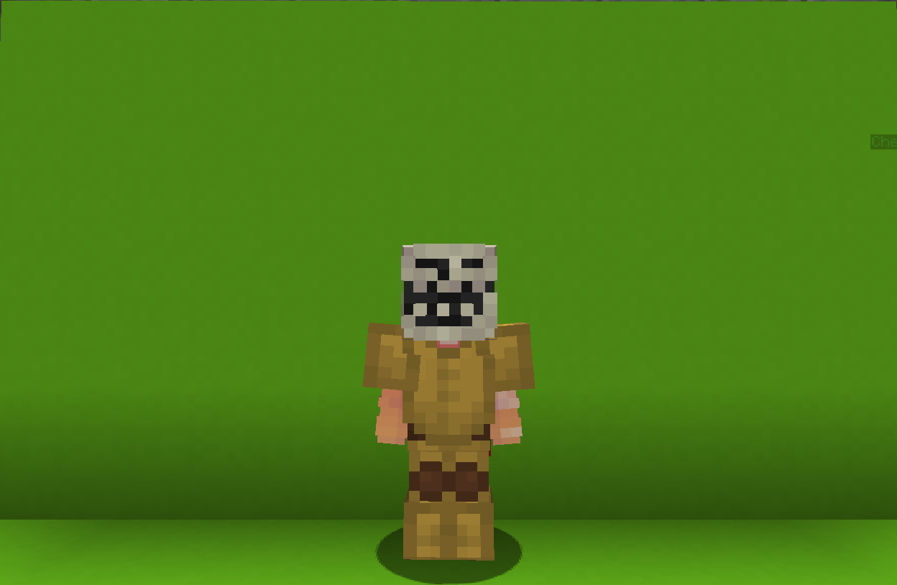

<table>
    <tr>
        <th>Troll</th>
    </tr>
</table>

<table>
    <tr>
        <th>Description</th>
    </tr>
</table>

>Not a good fighter... but definetly a good troll!
  Archetype:<b> 💡 Strategy</b>

 
<table>
    <tr>
        <th>Attributes</th>
    </tr>
</table>
<table>
    <tr>
        <th>Health</th>
        <td>♥ 100</td>
    </tr>
        <th>Attack</th>
        <td>🗡 100</td>
    <tr>
        <th>Defence</th>
        <td>🛡 100</td>
    </tr>
    <tr>
        <th>Speed</th>
        <td>🌊 100%</td>
    </tr>
    <tr>
        <th>Crit Chance</th>
        <td>☢ 10%</td>
    </tr>
    <tr>
        <th>Crit Damage</th>
        <td>☠ 50%</td>
    </tr>
    <tr>
        <th>Attack Speed</th>
        <td>⚔ 100%</td>
    </tr>
</table>
 

<table>
    <tr>
        <th>Weapon</th>
    </tr>
</table>
<table>
    <tr>
        <td><b>Stickonator</b></td>
        <td>
             - What's brown and sticky?
             - What?
             - A stick!
             - ...
        </td>
    </tr>
</table>

<table>
    <tr>
        <th>Talents</th>
    </tr>
</table>

---
<table>
    <tr>
        <th>Spin</th>
        <th></th>
    </tr>
    <tr>
        <td>
            Impair Talent
             Rotates all nearby opponents head 180 degrees.
        </td>
      <td>
          Details
           Impair
           Weaken enemies by debuffing them.
            Cooldown: 15s
           Point Generation: 1
           Raduis: 30 blocks
      </td>
    </tr>
    <tr>
        <th>Repulsor</th>
        <th></th>
    </tr>
    <tr>
        <td>
            Impair Talent
             Propels all nearby opponents high up into the sky.
        </td>
        <td>
            Details
             Impair
             Weaken enemies by debuffing them.
              Cooldown: 10s
             Point Generation: 1
             Radius: 10 blocks
        </td>
    </tr>
    <tr>
        <th>Last Laugh</th>
        <th></th>
    </tr>
    <tr>
        <td>
            Enhance Passive
             Your hits have 0.1% chance to instantly kill enemy.
        </td>
        <td></td>
    </tr>
    <tr>
        <th>Sticky Situation</th>
        <th></th>
    </tr>
    <tr>
        <td>
            Impair Ultimate
             Spawns a batch of cobwebs at your position that is only visible for your opponents.
              <i>Only one batch can exsist at the same time</i>
        </td>
        <td>
            Details
             Impair
             Weaken emenies by debuffing them.
              Cooldown: 20s
             Ultimate Cost: 40 ※
             Cast Duration: Instant
        </td>
    </tr>
</table>