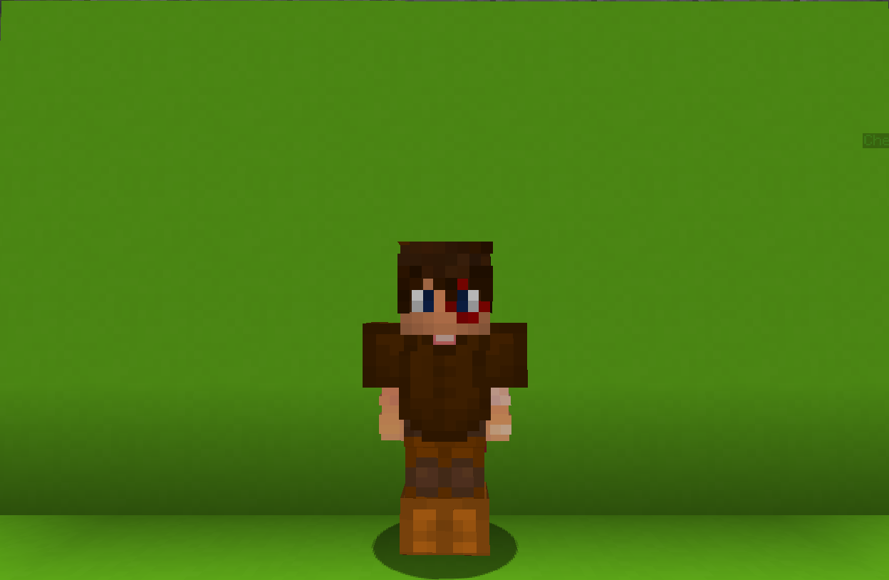

<table>
    <tr>
        <th>Vortex</th>
    </tr>
</table>

<table>
    <tr>
        <th>Description</th>
    </tr>
</table>

>A young boy with the power of speaking to stars.
  Archetype:<b> 💡 Strategy</b>

 
<table>
    <tr>
        <th>Attributes</th>
    </tr>
</table>
<table>
    <tr>
        <th>Health</th>
        <td>♥ 100</td>
    </tr>
        <th>Attack</th>
        <td>🗡 100</td>
    <tr>
        <th>Defence</th>
        <td>🛡 100</td>
    </tr>
    <tr>
        <th>Speed</th>
        <td>🌊 100%</td>
    </tr>
    <tr>
        <th>Crit Chance</th>
        <td>☢ 10%</td>
    </tr>
    <tr>
        <th>Crit Damage</th>
        <td>☠ 50%</td>
    </tr>
    <tr>
        <th>Attack Speed</th>
        <td>⚔ 100%</td>
    </tr>
</table>
 

<table>
    <tr>
        <th>Weapon</th>
    </tr>
</table>
<table>
    <tr>
        <td><b>Sword of tTousands Stars</b></td>
        <td>
            A sword with an astral link to the stars.
              <b>Ability: Despair RIGHT CLICK</b>
              Focus in the target <b>Astral Star</b> and axplode it, dealing <b>AoE damage</b>.
              Cooldown: 6s
        </td>
    </tr>
</table>

<table>
    <tr>
        <th>Talents</th>
    </tr>
</table>

---
<table>
    <tr>
        <th>Astal Slash</th>
        <th></th>
    </tr>
    <tr>
        <td>
            Damage Talent
             Launch an <b>astral</b> energy forward <u><b>follows</b></u> your crosshair.
              <i>The energy will disappea after 3s ir upon contact with a block.</i>
              The energy deals <b>rapid damage</b> and knocks enemies back.
              <i>The cooldown of this ability starts after the energy disappears.</i>
        </td>
      <td>
          Details
           Damage
           Deals damage to enemies
            Cooldown: 20s
           Point Generation: 2
           Max Duration: 3s
           Damage: 1
           Collect Distance: 2
           Shift Didstance: 0.5
      </td>
    </tr>
    <tr>
        <th>Astral Star</th>
        <th></th>
    </tr>
    <tr>
        <td>
            Creatable Talent
             Summon an <b>Astral Star</b> at your current plocation.
             <i>If used nearby a star, it will be picked up.</i>
              The stars are your guide! But only 7 can exist at the same time.
        </td>
        <td>
            Details
             Creatable
             This ability appears in the world as a physical entity.
              Cooldown: Dynamic
             Point Generation: 1
             Maximum Stars: 7
             Pickup Cooldown: 1.5s
             Summon Cooldown: 5s
        </td>
    </tr>
    <tr>
        <th>Star Aligner</th>
        <th></th>
    </tr>
    <tr>
        <td>
            Damage Talent
             Align with your target <b>Astral Star</b>, <b>teleporting</b> to it and launching an <b>Astral Slash</b>.
              <i>The star is consumed on teleport.</i>
        </td>
        <td>
            Details
             Damage
             Deals damage to enemies.
              Cooldown: 1s
             Point Generation: 1
        </td>
    </tr>
    <tr>
        <th>Liek a Dream</th>
        <th></th>
    </tr>
    <tr>
        <td>
            Enhance Passive
             Using Star Aligner grants you one stack of <b>⚡Astral Spark</b>.
              Each <b>⚡Astral Spark</b> stack increases <b>Astral Slash</b> DMG by <b>15%</b>.
              <i>Lose one stack agter not gaining a stack for 5s.</i>
        </td>
        <td></td>
    </tr>
    <tr>
        <th>All the Star</th>
        <th></th>
    </tr>
    <tr>
        <td>
            Damage Ultimate
             Instantly create <b>10 Astral Stars</b> around you.
              Agter a short delay, <b>rapidly</b> slash between them, <b>dealing damage</b> in a process befire finishing with a <b>final blow</b> that <b>slows</b> enemies.
              <i>This will not affect already placed stars.</i>
        </td>
        <td>
            Details
             Damage
             Deals damage to enemies
              Cooldown: 30s
             Ultimate Cost: 70 ※
             Cast Duration: 0,8s
        </td>
    </tr>
</table>