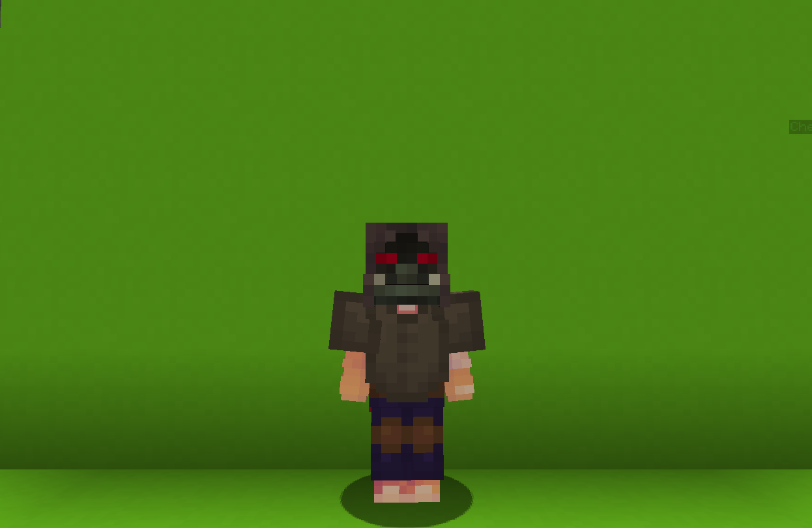

<table>
    <tr>
        <th>Shaman</th>
    </tr>
</table>

<table>
    <tr>
        <th>Description</th>
    </tr>
</table>

>An orc from the jungle. Always rumbles about something.
  Archetype:<b> 🍀 Support</b>

 
<table>
    <tr>
        <th>Attributes</th>
    </tr>
</table>
<table>
    <tr>
        <th>Health</th>
        <td>♥ 75</td>
    </tr>
        <th>Attack</th>
        <td>🗡 50</td>
    <tr>
        <th>Defence</th>
        <td>🛡 75</td>
    </tr>
    <tr>
        <th>Speed</th>
        <td>🌊 100%</td>
    </tr>
    <tr>
        <th>Crit Chance</th>
        <td>☢ 10%</td>
    </tr>
    <tr>
        <th>Crit Damage</th>
        <td>☠ 50%</td>
    </tr>
    <tr>
        <th>Mending</th>
        <td>🌿 200%</td>
    </tr>
    <tr>
        <th>Vitality</th>
        <td>🩸 50%</td>
    </tr>
    <tr>
        <th>Attack Speed</th>
        <td>⚔ 100%</td>
    </tr>
    <tr>
        <th>Effect Resistance</th>
        <td>🐚 30%</td>
    </tr>
</table>
 

<table>
    <tr>
        <th>Weapon</th>
    </tr>
</table>
<table>
    <tr>
        <td><b>Bamboo Stick</b></td>
        <td>An ordinary stick found in the jungle.</td>
    </tr>
</table>

<table>
    <tr>
        <th>Talents</th>
    </tr>
</table>

---
<table>
    <tr>
        <th>Totem</th>
        <th></th>
    </tr>
    <tr>
        <td>
            Input Talent
             Equip a <b>Totem</b> and prepare to toss it.
             After a <b>Totem</b> lands. it <b>activates</b> and does one of the following actions every <b>1.5s</b> based on the <b>Resonance</b>.
             <i>There is a small chance for totem to explode violently.</i>
              <b>LEFT CLICK to Resonate Discord</b>
             <i>Damage</i>
             Periodically deals <b>damage</b> to nearby <u>enemies</u>.
              <b>RIGHT CLICK to fiesonate Harmony</b>
             <i>Support</i>
             Periodically <b>heals</b> all nearby <u>allies</u>.
        </td>
      <td>
          Details
           Damage
           Deals damage to enemies.
           Duration: 20s
           Point Generation: 1
           Vertical Velocity: 0.3
           Velocity: 0.8
           Chance to Explode: 20%
           Explode Damage: 10
           Interval: 1.5s
           Max Totems: 3
      </td>
    </tr>
    <tr>
        <th>Imprisonment</th>
        <th></th>
    </tr>
    <tr>
        <td>
            Impair Talent
             Imprison the <b>target enemy</b> in a stone cage, preventin them from moving.
        </td>
        <td>
            Details
             Impair
             Weaken enemies by debuffing them.
              Cooldown: 16s
             Duration: 6s
             Point Generation: 1
             Height: #
        </td>
    </tr>
    <tr>
        <th>Shaman's Mark</th>
        <th></th>
    </tr>
    <tr>
        <td>
            Support Talent
             Launch a projectile forward that travels up to <b>15 blocks</b>.
              If the projectile hits an <b>ally</b>, it applies the <b>Shaman's Mark</b> onto them.
              <b>Shaman's Mark</b>
             While active, increases <b>🌊 Speed, 🗡 Attack</b> and <b>⚔ Attack Speed</b>.
              The mark exists <u>indefinitely</u> as long as the <b>ally</b> is within the <b>line of sight</b>.
              <i>Only ane mark can exist an a single
            at any gily•en time.
             Marks from different Shamans don't stack.</i>
        </td>
        <td>
            Details
             Support
             Provide buffs to teammates.
              Cooldown: 16s
             Point Generation: 1
             Out Of Sight Duration: 2s
             Speed Increase: 0.1
             Attack Increase: 0.3
             Attack Sppeed Increase: 0.2
             Projectile Step: 0.5
             Max Projectile Distance: 15 blocks
        </td>
    </tr>
    <tr>
        <th>Overheal</th>
        <th></th>
    </tr>
    <tr>
        <td>
            Enhance Passive
             When <b>healing</b> an <b>ally</b> who is already at <u><b>full health</b></u>, the excess <b>healing</b> is converted into <b>Overheal</b>.
              When <u>you</u> or <u>your</u> allies deal <b>damage</b>, it's increasedby your <b>Overheal</b>
             <i>The Overheal is consumed with the damae.</i>
        </td>
        <td></td>
    </tr>
    <tr>
        <th>Spiritual Chasing</th>
        <th></th>
    </tr>
    <tr>
        <td>
            Support Ultimate
             Instantly cleanse all <b>negative</b> effects from nearby <b>allies</b>.
              Also increase their <b>🐚 Effect Resistance</b> for <b>12s</b>.
        </td>
        <td>
            Details
             Support
             Provide buffs to teammates.
              Cooldown: 30s
             Duration: 7.5s
             Effect Res Increase: 0,5
             Effect Res Increase Duration: 12s
             Ultimate Cost: 645 ※
             Cast Duration: Instant
        </td>
    </tr>
</table>